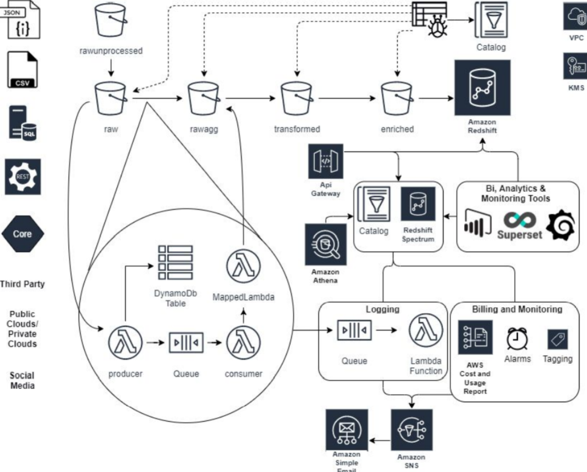

## Portfolio

---
### Data engineer in Comafi Bank

Remote job - Buenos Aires - Argentina

**As Cloud Developer in October 2020 to Febrary 2021** 

- **Project description:** I join a consulting firm in October 2020 to February 2021 as Cloud Developer to migrate a datalake for a bank in Chile on AWS with IaaC tools: Terraform and Cloudformation. 
We work with Linux Ubuntu, PyCharm, AWS, Terraform, Cloudformation

**As Data Engineer in April 2021 - January 2022**

- **Project description:** I started working with the consulting company again in April 2021 to January 2022 as a Data Engineer to develop a datalake for a bank in Buenos Aires. There we use two different providers: Azure and AWS. 

We work in Azure with Databricks, Scala and PySparks, Spark, Kafka.  

The project of the creation of the AWS Datalake in which I am involved includes the following steps:

---
[Back](./)

