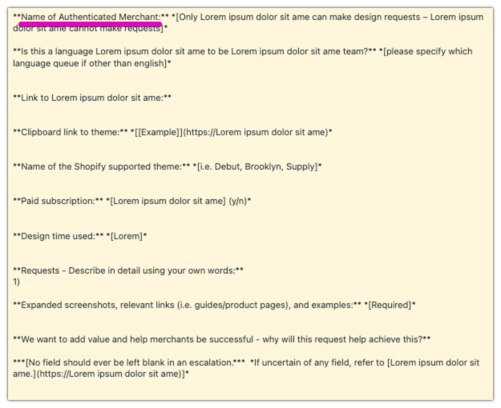
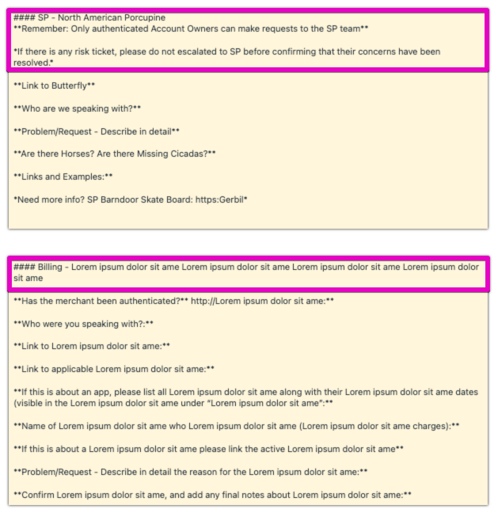

# Reducing form input error

- Role: Data analyst
- Situation: High rate of missing field in a form
- Task: Error reduction.
- Action: Issue investigation, Solution implementation & validation.
- Result: 40% reduction in error.


### TL;DR
As a Theme Support Specialist at Shopify we receive various requests from our merchants to customise and improve their store.

Shortly after joining the team I noticed the *merchant name* field on the customisation request form was often left blank by the frontline support team, and decided to investigate the issue to reduce the error. 


### 1. Issue validation

After confirming the issue was felt among many members of the team, I moved onto running a quick quantitative analysis to gauge the volueme of the issue and potential impact of solving it:

- Total request tickets: XXX
- Missing merchant name tickets: XXX
- Missing merchant name ticket rate: 40.21%
- Time lost from error compensation: 7 days per year

- **Success criteria**: Missing merchant name ticket rate to be under 5%


### 2. Hypotheses building

Following the issue validation I have moved onto qualitative research into the issue to understand the root cause of the issue and potential solutions, and collected the following insights:

- *Merchant name* field is located right at the top and it looks like as if it is a part of instruction about request process.

-	6 out of 6 randomly selected request forms (other than theme customisation) had a block of instructional text at the top.

- The insight above has proved to be common understood of the likely cause when discussed at  team discussion.
- [Jakob's Law of the Internet User Experience](https://www.nngroup.com/videos/jakobs-law-internet-ux/) states it is best to align your form to look like the rest.


### 3. Solution proposal

Given the qualitative and quantitative evidence, I have set the hypothesis that the deisgn of the form to be the culprit of the high error rate, and proposed the following solution:

#### "Introduce a header area for the theme customisation request template to align with other forms used by the frontline support team"

New request form template was designed with the considerations above, and published to the production system.

### 4. Solution assessment + Issue handling

The number of tickets with missing merchant name have dropped from 40.21% to 0.15% (literally just one ticket out of XXX tickets using the new template during the sample period).

However changes to other fields were included despite the best practice to only change a single variable at a time, due to limited resources to publish the change.

After few anecdotal reports of another field being left blank, I have decided to investigate further. Using the data collected HH hours before & after the update I have noted the following:

Original wording **before** the change
```
Total tickets: 363
Missing link to theme file: 21
Missing rate: 5.79%
```
New wording **after** the change
```
Total tickets: 210
Missing link to theme file: 23
Missing rate: 10.95%
```

Given the rate of ticket missing the link to theme had risen from 5.79% to 10.95% with high statistical significance (P Value at 0.185% using Chi^2 Test), I quickly proceeded to reverse the wording to original as a quick fix.

```
Expected		12.15
ChiSq / P value		0.00185
```


### 5. Result & Learnings

The project sparked active discussion among the colleagues and completed with **successfully reducing the error rate from 40.21% down to 0.15% in 59 days**. Impact was equiverant to reducing of 7 days worth of specialist labour.