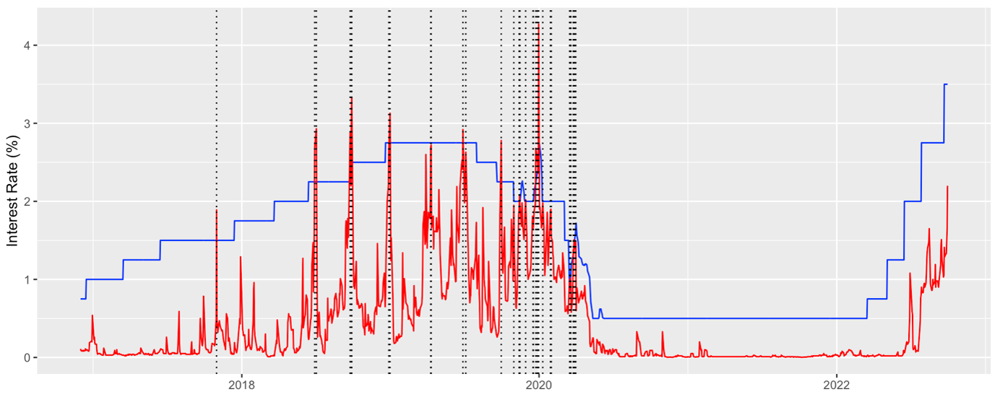

# Selected Projects in Data Science and Econometrics

---

## [Web Scraper for Public Housing Transaction Data](https://github.com/johnthwong/housing-authority-scraper)
The Housing Authority's data on secondary transactions of subsidized flats are notoriously difficult to access as the data must be requested by month, each with a separate web form. So I built a scraper that automatically submits forms and gathers transaction count in each month into one CSV file.
 
 
Built with Python and Selenium.
 
 
Check it out here: [https://github.com/johnthwong/housing-authority-scraper](https://github.com/johnthwong/housing-authority-scraper)
 
 

 
 
---

## Visualization of the Hong Kong's Reserves
After a drop in the balances of accounts held at the central bank by commercial banks (aka "Aggregate Balance") in the summer of 2022, there was [panic](https://www.bloomberg.com/news/articles/2022-07-26/hong-kong-liquidity-shrinks-50-since-may-amid-currency-defense) that Hong Kong's currency peg with the USD would break. In response, I wrote a report on why "Aggregate Balance" is insignificant and not worth freaking out about.
 
 
This project parses JSON data from the Hong Kong Monetary Authority. Data manipulation and visualization are done with R's dplyr and ggplot libraries.
 
 

 
 
---

## [Dear HKMA: Mandate Banks to Use the Discount Window](https://johnthwong.github.io/page_dw)
I wrote in a policy memo in December 2022 that the HKMA (Hong Kong's central bank) should regularly mandate random banks to use the discount window (DW). This would prevent the HIBOR from breaching the Base Rate, which hurts both mortgage borrowers and banks. [Read more](https://johnthwong.github.io/page_dw)

**When HIBOR (red) Breaches the Base Rate (blue)**

 
 

---

## [Do Societies With Greater Populations Innovate More?](https://arxiv.org/abs/2211.00410)
In this paper, we estimate how variations in population sizes across US states causally impacted these states’ capacity to produce patents. To rule out the endogeneity of fertility decisions, we estimate the difference-in-difference in births before and after the Roe ruling, and then use estimated births as an instrumental variable to predict patents per capita.
 
 
Check out the full paper here: [https://arxiv.org/abs/2211.00410](https://arxiv.org/abs/2211.00410)
 
 
**Estimating Patents Granted per Capita on Births Using Roe as an Instrumental Variable**

 
 
---

## Predicting the Conflict in Developing Regions Using Machine Learning Decision Trees
As part of a term assignment, we predicted the likelihood of armed conflicts within 50-kilometer squares by fitting a large panel of predictors to both a decision tree model specifically designed for panel data (RE-EM tree) and an artificial neural network. 
 
 
This project used R's dplyr and data.table libraries and also Google's Python package—Keras—for interfacing with Tensorflow.
 
 
**RE-EM Tree for Predicting Conflict**

 
 
---
