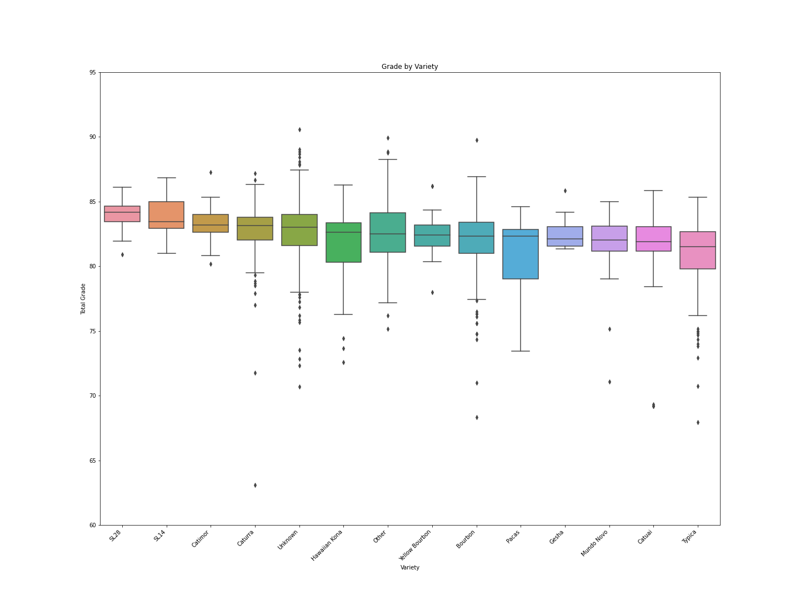
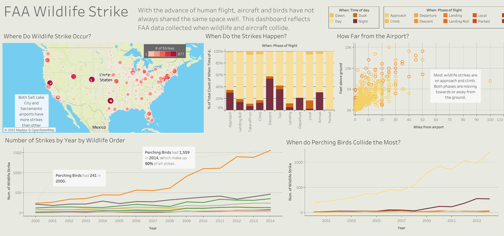

## Portfolio

---

### Personal Projects

- [Uploading CSV to Google Sheets]()

---

### BigCommerce Bigquery Projects

- [Order Location SQL](/order_location_sql)

---

### Codecademy Projects

[Codecadamy Final Project](https://www.kaggle.com/code/mikemiller117/codecadamy-final-project-data-analysis) - This links to a Kaggle Notebook.

---
[FAA Wildlife Strike Visualization](https://public.tableau.com/views/FAAWildlifeStrike_16806281859640/Dashboard1?:language=en-US&publish=yes&:display_count=n&:origin=viz_share_link) - This links to Tableau page.

---

Page template forked from <a href="https://github.com/evanca/quick-portfolio">evanca</a>

<!-- Remove above link if you don't want to attibute -->
