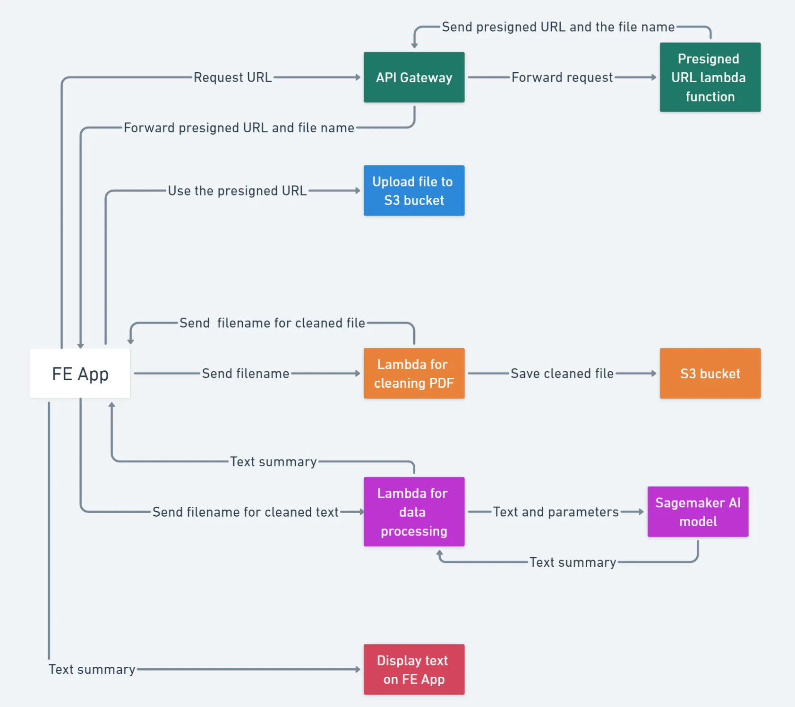

## Portfolio
### Simulating Vaccine Distribution Strategies in an Epidemic 

I simulated a short-term epidemic spread in Python to assess the impact of mitigation strategies like social distancing and vaccinations. All output analysis was conducted in R.

<a href="https://github.com/gaurikapse/Vaccination-and-Epidemic-Spread">
  View Code on GitHub
  
</a>

 
  
   
   
   
   
  
   
   

---
### Building an NLP Powered Legal Text Summarizer

  The Indian Central Government encourages ministries to place proposed legislations in the public domain for 30 days prior to making any decisions. During this period, anyone can provide feedback on the proposals. We worked with a non-profit, <a href="https://www.civis.vote/">Civis</a>, to leverage AI to summarize these proposals for the general public, and improve readability and access.

  Read 
  <a href="https://blog.commutatus.com/building-an-nlp-powered-legal-text-summarizer-part-1-d114e24a8c5c">part 1</a> and 
  <a href="https://blog.commutatus.com/building-an-nlp-powered-legal-text-summarizer-part-2-990ca8a11c8a">part 2</a>  
  of a recap of our efforts on Medium (articles co-authored by me and my colleague, but Medium doesn't allow multiple authors). 

 
   
   
  
  
   
  

---
### Identifying Brain Proteins Critical for Learning in Mice with Down Syndrome

An attempt at replicating the results of the 2015 paper “Self-Organizing Feature Maps Identify Proteins Critical to Learning in a Mouse Model of Down Syndrome,” using a combination of non-linear dimensionality reduction and spectral clustering. The authors of the original paper have used self-organizing feature maps (SOM).

<a href="#">
  View Code on GitHub
  
</a>

 
   
   
  
   

---
