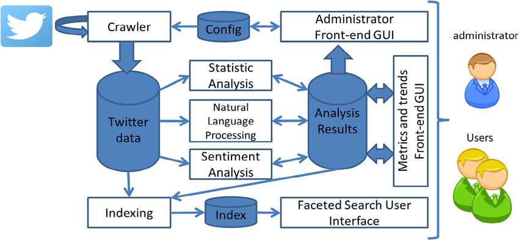
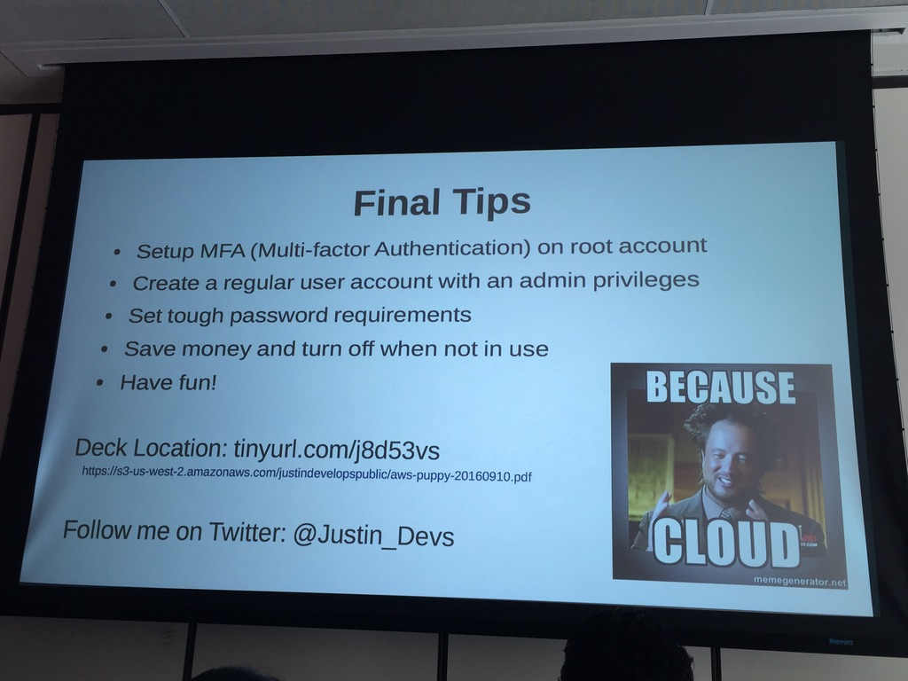

# Portfolio
---
## Natural Language Processing

### Twitter Sentiment Analysis: Lets Make Friends
### 0 of 7

The [Let's Make (Twitter) Friends in Seattle](https://www.eventbrite.com/e/lets-make-twitter-friends-tickets-27060418440)hackathon was hosted by a Institute for Systems Biology  in Seattle to encourage python users on writing useful 
code 
integrating API calls and AWS hosting.
AWARD: First Prize Most Entertaining and Useful Social Media Engagement.

[KimBot](https://github.com/datatalking/Kimbot)
An early adopter of technology gets to enjoy the fruit of their labor much earlier in the project and this creates a 
path forward on other projects use extensable and economically viable methods of using data.

Our shared idea was expanded upon in a [2018 Paper](https://www.researchgatenet/publication/317977462_Predicting_TV_programme_audience_by_using_twitter_based_metrics) that was trained 
using crawled data 
from television programs

What started as an chatbot that would immitate Kim Kardashian stalled out as 82% of her conversation were hair, 
clothes and her butt which were not interesting. So over the weekend we evolved this into a hackathon winning Markov 
inspired chatbot
trained and hosted on AWS EC2 micro 
instance using publicly available twitter training data from Silicon Valley and Tweets from Startups and 
@marvelavengers accounts to make traffic alerts more fun.

()
We trained a Markov agent on episodes of Silicon Valley and Tweets from Startups that were mashed with 
@marvelavengers to 
automatically 
generate computationally efficient 
replacement 
texts that increase engagement and transform (otherwise) mundane Traffic (noisy) reports into engaging, educational 
social media engagement for about $12 a month in AWS charges.

https://s3-us-west-2.amazonaws.com/justindevelopspublic/aws-puppy-20160910.pdf
tinyurl.com/j8d53vs
@Justin_Devs

### RankUp: Lets Find Jobs
### 0 of 7

The hackathon was hosted by a lifescience company in Seattle to encourage API education.

[KimBot](https://github.com/datatalking/Rankup)
- "# TODO add video"
- "# TODO update codebase"
- "# TODO update model to BERTnERNIE"

### MATH341: Statistical t-test implementation
### 1 of 7
t-test gif here
My complete implementation of assignments and projects in [***MATH341: Applied Statistical Methods I***](https://catalog.bellevuecollege.edu/preview_course_nopop.php?catoid=5&coid=17895) by Bellevue College (Winter, 2021)
([GitHub](https://github.com/datatalking/CS224n-NLP-Assignments/tree/master/assignments/a3))

### MATH340: Automated K-Means Computation
### 2 of 7
KMEANS GIF here

### Multi-Environment bug in Python 3.7
### 3 of 7
Fixed bug in Python 3.7 for multi-environment computation.
bug list or other GIF here
cihwof-vyvteS-9matre
[Python Constants Contributor](https://github.com/3kwa/constants)
In October 2022 python 3.7 was being deprecated I had terabytes of data that needed to be migrated and requiring a 
tool on 
Python 
3.7 
while using a multi-environment that I was migrating but the code wasn't working. After searching I 
found the repo for constants thankfully was written in python and once I was able to dig into the code base it was 
found that the `TOX.ini` file was only updated through python 3.3 a PR was submitted and I was able to process 11 
terrabytes of data and while python 3.7 is officially deprecated I can still use  it on select tools. Future updates 
are in the que to update this tool through Python 3.10

### Morningstar API integration with SQL database bug
### 4 of 7
MORNINGSTAR LOGO here

[Mstables Contributor](https://github.com/caiobran/mstables)
Webscraping and datamining the Morningstar.com API was a 
natural starting point for my algorithm trading project. Expanding upon [Caiobran](https://github.
com/caiobran/mstables) we automated the SQL database and are now working to expand financial source data to include 
any existing flatfile or databases and the suite of tools from [Panda Datareader](https://github.com/pydata/pandas-datareader)
1. [Tiingo](https://pandas-datareader.readthedocs.io/en/latest/remote_data.html#remote-data-tiingo)
2. [IEX](https://github.com/iexcloud)
3. [Alpha Vantage](https://www.alphavantage.co/documentation),
4. [Econdb](https://www.econdb.com/series/RGDPUS/)
5. [Enigma](https://developers.enigma.com/reference/authentication),
6. [Quandl](https://data.nasdaq.com)
7. [St.Louis FED (FRED)]()
8. [Kenneth French’s data library](http://mba.tuck.dartmouth.edu/pages/faculty/ken.french/data_library.html)
9. [World Bank]()
10. [OECD]()
11. [Eurostat]()
12. [Thrift Savings Plan]()
13. [Nasdaq]()
14. [Stooq]()
15. [MOEX]()
16. [Naver Finance]()
17. [Yahoo Finance]()

Collaborating with We have been udating the 
repo 
with 
database fixes, 
automating the testing, ingestion 

### MATH340: Automated K-Means Computation
### 5 of 7

FUTURE
### DA460: Implementation of Bert Glove Transformer for Resume ingestion
### 6 of 7

### DA460: Testing of Bert-Ernie Glove Transformer 
### 6 of 7

What started as an expansion upon my early work in Chatbots evolved to need a more efficent solution found in a hybrid 
implementation of 
Hugging Face 
BERT 
model for 
expansion to an NLP chatbot for a 
class 
project 
soon grew to beyond the 
scope and lack of GPU access. BERT stands for Bidirectional Encoder 
Representations 
from Transformer
ERNIE is my prototype Emotional Recognition Natural Language Intelligence Engine
BERT-ERNIE gif
As part of my research for Machine Learning is to build a model that can process and understand emotional intent or 
causality from conversational logs with people.

### References:
- Smarter Healthcare Chatbots as functional architecture is presented that is proposed to build an intelligent chatbot 
  for 
  health care assistance 
based on deep learning models

[Semantic Scholar - Smart NLP Architecture](https://www.semanticscholar.
org/paper/A-Smart-Chatbot-Architecture-based-NLP-and-Machine-Ayanouz-Abdelhakim
/15cbcf124c3b385b605005c37b0da384ba1d1e02)

