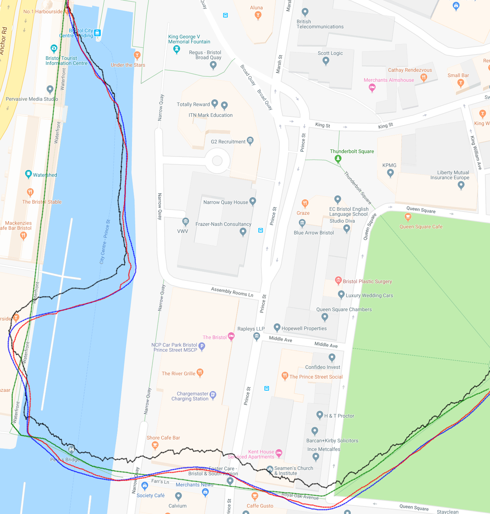

# Portfolio

## [CV](https://github.com/hw16471/hw16471.github.io/blob/master/pdf/Harry%20Waugh%20-%20Jan%202019.pdf)
### The lastest version of my CV can be downloaded [here](https://github.com/hw16471/hw16471.github.io/blob/master/pdf/Harry%20Waugh%20-%20Jan%202019.pdf).

## [Computer Graphics Raytracer](https://github.com/ainsleyrutterford/UOB_Raytracer)

### Overview

### Compile and Run

### Technologies 
* C
* OpenCL
* OpenGL Mathematics (GLM)
* Simple DirectMedia Layer (SDL2)

---
## [Parallel Optimisations of a Lattice Boltzmann Code](https://github.com/hw16471/UOB_OpenCL_LBM)

### Overview

### Compile and Run

### Technologies 
* C
* OpenCL

---
## [Web Technologies](https://github.com/hw16471/UOB_Web_Tech_CW)

### Overview

### Compile and Run

### Technologies 
* HTML ( Dynamically created using Pug.js )
* Javascript ( JQuery, Ajax )
* CSS 
* NodeJS Server with embedded SQLite3 database

---

## [Thesis: Using Sensor Fusion and Deep Learning to Improve Activity Tracking](https://github.com/hw16471/ActivityTrackingWithSensorFusion)

### Overview

### Compile and Run

### Technologies 
* Python
* NumPy, SciPy and Pandas
* Tensorflow
* Keras

---

## [Detecting Dartboards](https://github.com/hw16471/UOB_DartboardDetector)

### Overview

### Compile and Run

### Technologies 
* C++ 
* OpenCV

---

## [Applied Security](https://github.com/hw16471/AppliedSecurity)

### Overview

### Compile and Run

### Technologies 
* C

---
