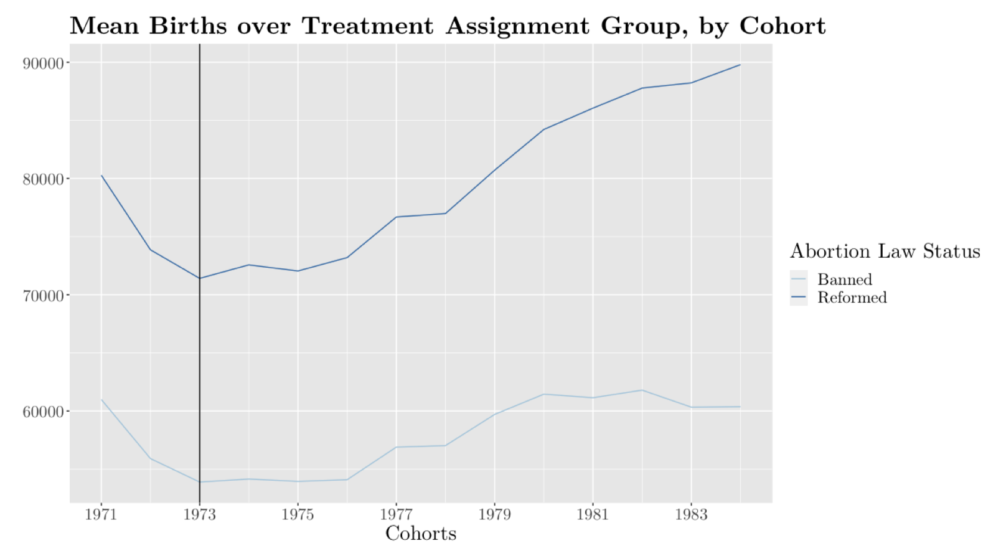
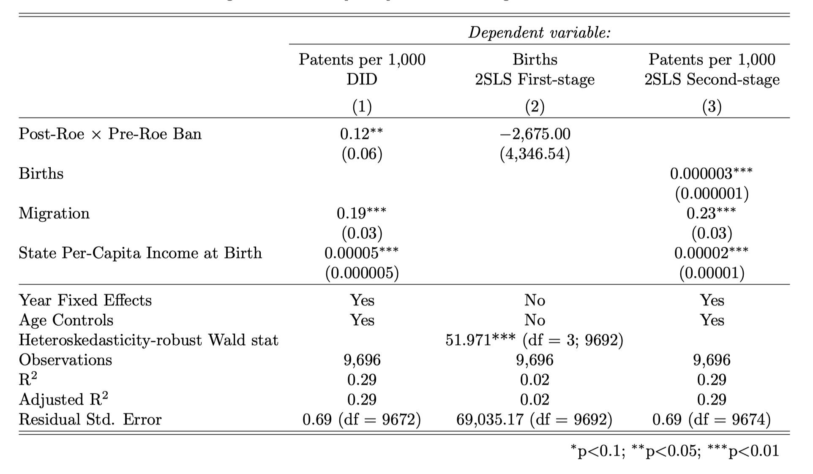
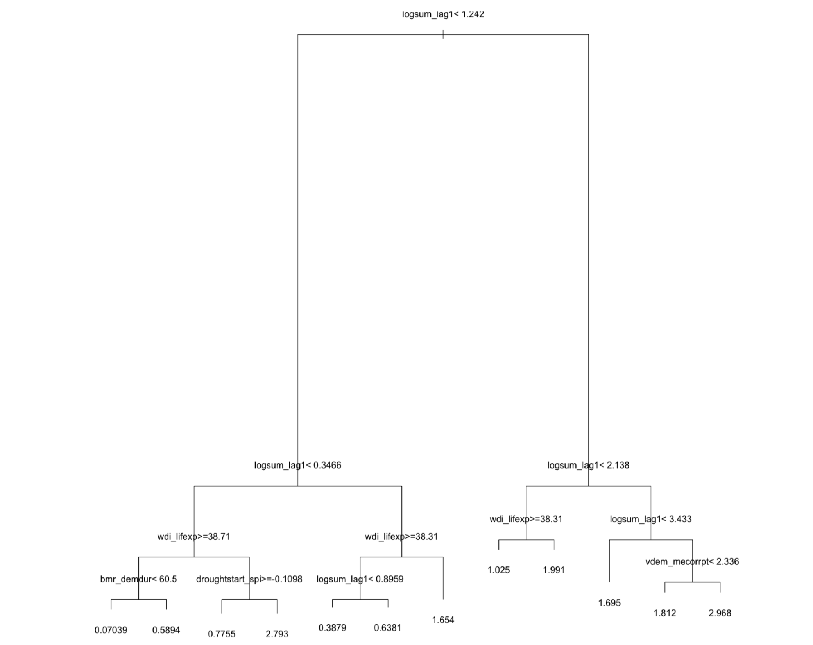

# Portfolio

---

## [Web Scraper for Public Housing Transaction Data](https://github.com/johnthwong/housing-authority-scraper)
The Housing Authority's data on secondary transactions of government-built, privately-owned flats (aka SSFs) are notoriously difficult to access as the data must be requested by month, each with a separate web form. The Housing Authority Scraper automatically gathers the transaction count of SSFs by month and year and generates a CSV file that can be easily used for further research, such as the analysis of trading volume.
 
 
Built with Python and Selenium.
 
 
Check it out here: [https://github.com/johnthwong/housing-authority-scraper](https://github.com/johnthwong/housing-authority-scraper)
 
 

---

## Visualization of the Hong Kong's Reserves
After a drop in the balances of accounts held at the central bank by commercial banks (aka "Aggregate Balance"), there was a [panic](https://www.bloomberg.com/news/articles/2022-07-26/hong-kong-liquidity-shrinks-50-since-may-amid-currency-defense) in the summer of 2022 over the viability of Hong Kong's currency peg with the USD. In response, I wrote a report at the time to contextualize the city's monetary base and to show how little of it is composed of "Aggregate Balance."
 
 
This project parses JSON data from the Hong Kong Monetary Authority. Data manuipulation and visualization are done with R's dplyr and ggplot libraries.
 
 

---

## Do Societies with Greater Populations Innovate More?
In this paper, we estimate how variations in population sizes across US states causally impacted these states’ capacity to produce patents. To rule out the endogeneity of fertility decisions and estimate the causal effect of cohort births on patent production, we use the US Supreme Court’s ruling on Roe v. Wade as an instrumental variable due to its heterogenous impact on different states.
 
 
Check out the full paper here: https://arxiv.org/abs/2211.00410
 
 

---

## Predicting the Conflict in Developing Regions Using Machine Learning Decision Trees
We predict the likelihood of armed conflicts within 50-kilometer squares by using predictors such as the presence of minerals and governance quality. The data is fitted to both a panel data-specific decision tree model (RE-EM tree) and an aritificial neural network. 
 
 
This project used R's dplyr and data.table libraries and also the Keras package for Python.

---
