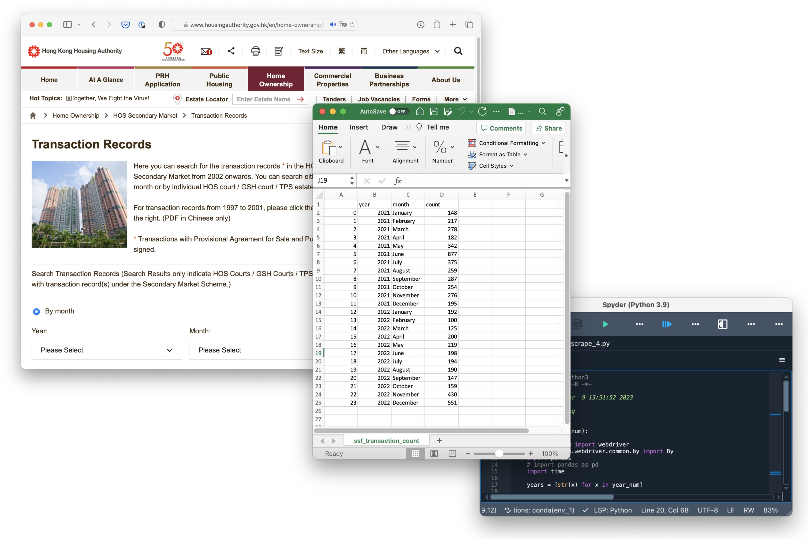
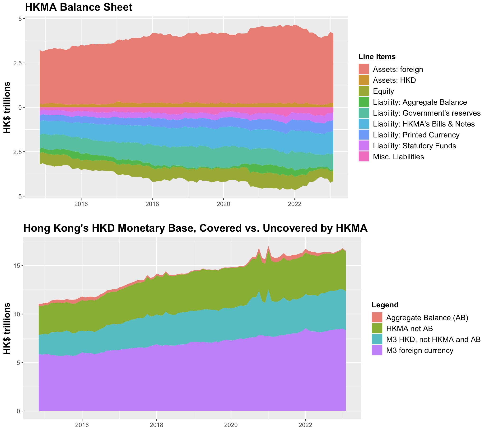

# Portfolio

---

## [Web Scraper for Public Housing Transaction Data](https://github.com/johnthwong/housing-authority-scraper)
The Housing Authority's data on secondary transactions of government-built, privately-owned flats are notoriously difficult to access as data must be requested with a separate web form for each month. The Housing Authority Scraper gathers the transaction count of these flats by month and year and generates a CSV file that can be easily used for further research, such as the analysis of trading volume or housing supply.
 
 
Built with Python and Selenium.
 
 

---

## Visualization of the Hong Kong's Reserves
After a drop in interbank liqudity (aka Aggregate Balance), there was a [panic](https://www.bloomberg.com/news/articles/2022-07-26/hong-kong-liquidity-shrinks-50-since-may-amid-currency-defense) in Summer 2022 over the viability of Hong Kong's currency peg with the USD. In response, I wrote a report at the time to contextualize the city's monetary base and to show how little of it is affected by interbank liquidity. 
 
 
This project parses JSON data from the Hong Kong Monetary Authority. Data manuipulation and visualization are done with R's tidyr and ggplot libraries.
 
 

---
