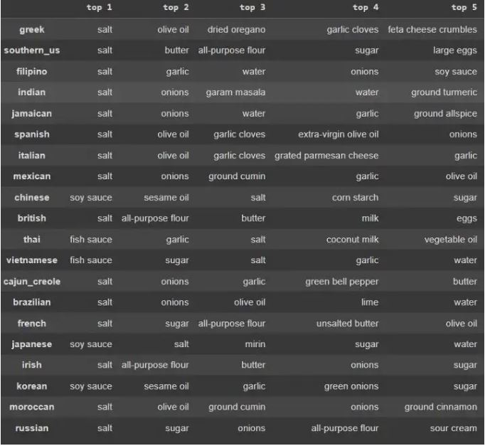
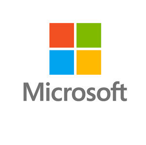
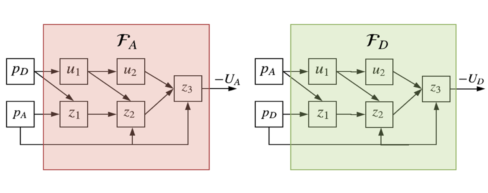
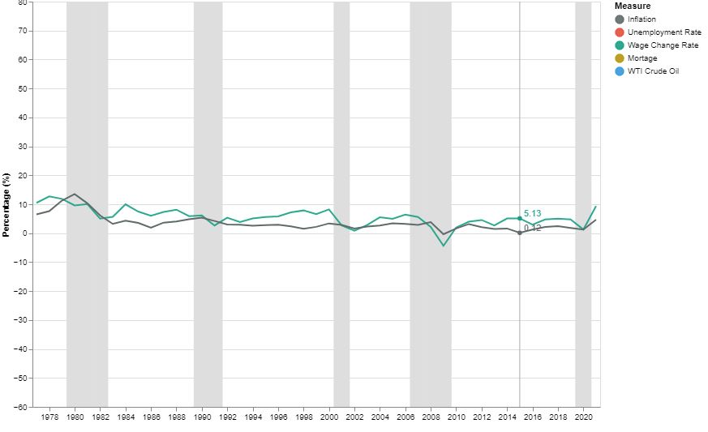
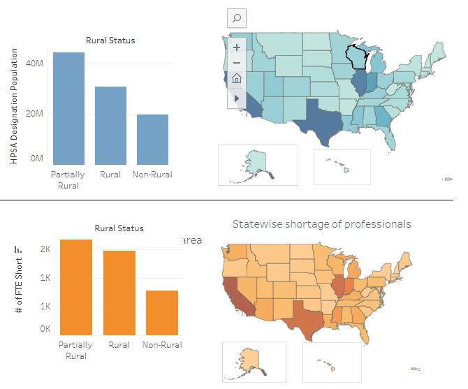
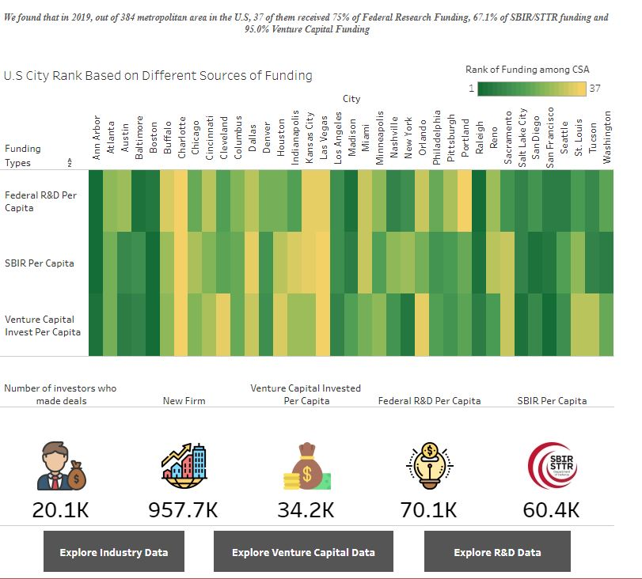

# Portfolio

---

## Machine Learning 

### [Cuisine Classifier](https://medium.com/p/8d75a90a69d7)

---

### [Microsoft Internship: Sparse Transformers on FPGA Firmware](/pdf/bert.pdf)

---

---
### [Neural Network for Cyber Security](/pdf/CDC_presentation_portfolio.pdf)

---

## Visualization

### [Visualizing Inflation in the US](https://shruti-misra.github.io/inflation_viz/)

---
### [Mental Health Practitioner Shortage in the US](https://public.tableau.com/app/profile/shruti.misra/viz/MentalHealthProfessionalsShortageintheU_S/Dashboard1)

---

### [Innovation in US Cities](https://shruti-misra.github.io/innovation-dashboard/)

---

---
