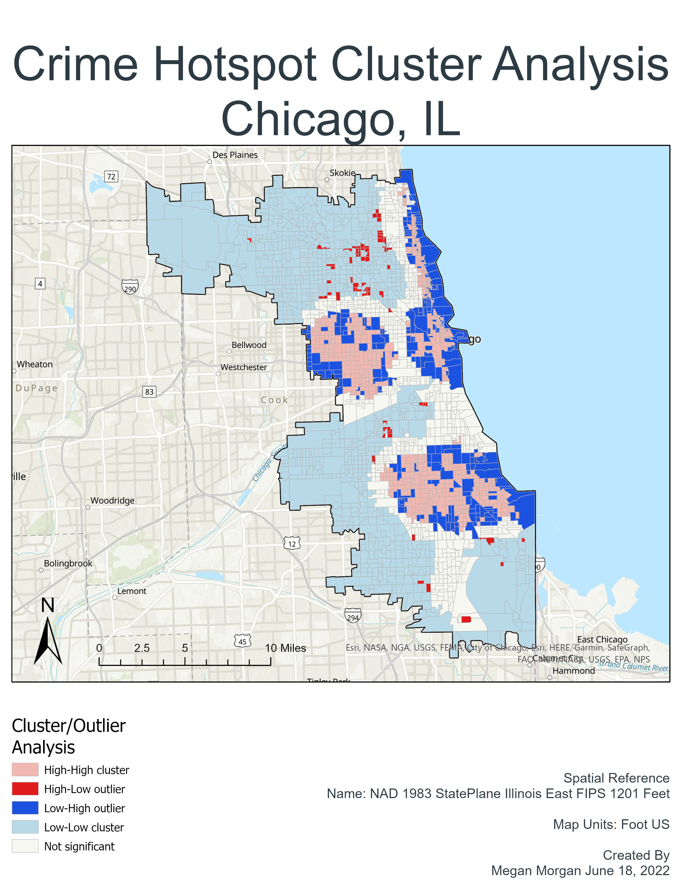

# Project Examples

---
## Final Projects 

# [Where in the USA is Carmen Sandiego?](/pdf/CarmenSandiego.pdf)

A Python project showcasing arcpy and Jupyter Notebook.
    One popular game has tried to solve the problem of the declining geographic knowledge of the United States for almost the last 40 years. “Where in the World is Carmen Sandiego” is a video game turned game show, turned television show.

Geography is not everything, in addition to the terrain, one also needs to know about the people who live and work there. This work merges geography with census data to provide details on demographics, disability proportions, and populations to name a few criteria. To improve the world, all it takes is for one person to learn more than they knew the day before. So, gumshoe, as we follow in the footsteps of IBM, PBS, and Netflix, there is just one question left to answer: “Where in the USA is Carmen Sandiego?”.

<a href="/pdf/CarmenSandiegoProjectProposal.pdf">Project Proposal</a>

<a href="/pdf/CarmenSandiego.pdf">Final Project Report</a>

---

# [Flying Home for Christmas](/pdf/FlyingHomeforChristmas.pdf)

A R-Studio project showcasing statistical analysis.

Air traffic delays in the United States and have become one of the most common reasons for passenger complaints and flight delays are even more common with more than one fifth of all domestic flights arriving at least 15 min behind schedule. These delays have several sources; some being customer related, others airline or airport related, and others just impacted by the weather. Officially these delay categories are aircraft arriving late, from previous leg; National Aviation System, or NAS; airline crew or maintenance; extreme weather, blizzard, hurricane, temperature, etc.; and security issues. So, if someone was to leave the Dallas-Fort Worth Texas metroplex and try to make it home for Christmas; assuming they were first willing to spend the “travel premiums" up to 82.0% above the usual ticket price; should their relatives set a place at the table and count on them being home for Christmas?

<a href="/pdf/FlyingHomeforChristmas.pdf">Final Project Report</a>

---

# [Red Rover, Red Rover, Let Windy Come Over](/pdf/WeatherAnalysis.pdf)

A SQL project showcasing database creation, manipulation, interpretation, and analysis.

Insurance companies have performed risk assessments for decades, so the concept of identifying one’s odds of a weather occurrence is nothing new. When one goes to purchase homeowners, renters, and/or automobile insurance a price listing is presented for your ala carte selection. Counties that are known to have a higher likelihood of an occurrence will have a higher premium, and vice versa. This project performs several queries are run to combine different datasets and perform analysis about the weather phenomenon in certain counties. Selecting the data from the weather tables (tornado, hail storms, and wind storms) and joining it to the United States Counties table. From there calculations for number of weather events per county and number of events per state, as an example. But should one go ahead and spend the money on the insurance despite the odds on the off chance of an event occurring again?

<a href="/pdf/WeatherProposal.pdf">Project Proposal</a>

<a href="/pdf/WeatherAnalysis.pdf">Final Project Report</a>

---

## ArcGIS Pro Projects 

# [Spatial Interpolation and Kriging](/pdf/MMorgan_GIS5253-999_AssignmentVI.pdf)

---

# [Hot Spot and Cluster Analysis](/pdf/MMorgan_GIS5253-999_AssignmentV.pdf)

---

# [MCDA Location Analysis](/pdf/MMorgan_GIS5253-999_AssignmentIV_Redo.pdf)

---

# [Austin Transitshed Analysis](/pdf/MMorgan_GIS5253-999_AssignmentII_Redo.pdf)

---

---

Page template forked from <a href="https://github.com/evanca/quick-portfolio">evanca</a>

<!-- Remove above link if you don't want to attibute -->
