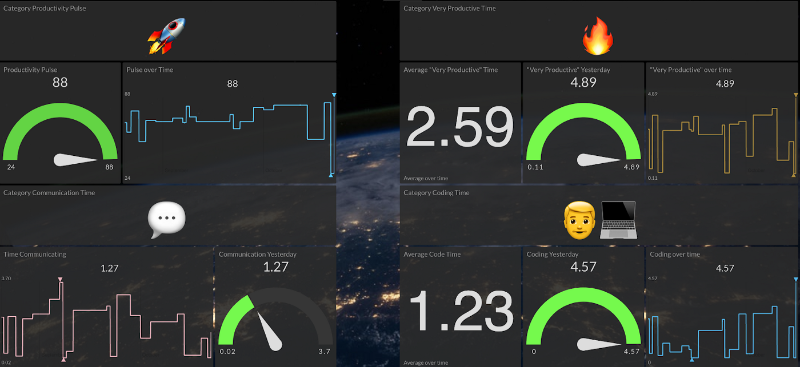

<link rel="apple-touch-icon" sizes="180x180" href="/apple-touch-icon.png">
<link rel="icon" type="image/png" sizes="32x32" href="/favicon-32x32.png">
<link rel="icon" type="image/png" sizes="16x16" href="/favicon-16x16.png">
<link rel="manifest" href="/site.webmanifest">

## Portfolio

---

### Professional 

[Self Building Jenkins CI Server](/self-building-jenkins)

---
[Launching an Open Source Office](/OSO-launch)

---
[Automated Branch Protection Web Service](https://github.com/zkoppert/Auto-branch-protect)

---
[Article on Productivity Dashboard for Devs](https://medium.com/initial-state/productivity-dashboard-for-devs-58eea6b2c59a)

---

### Personal

- [GitHub App - Comments on new issues](https://github.com/zkoppert/Carl-the-llama)
    - I used this project as an opportunity to learn CI with JavaScript, CD to AWS Lambda, project documentation and security scanning with semmle.
- [Article on Career Planning](https://medium.com/@zacheryk89/career-planning-in-tech-91b650457a59)

---

---

Page template forked from <a href="https://github.com/evanca/quick-portfolio">evanca</a>

<!-- Remove above link if you don't want to attibute -->
