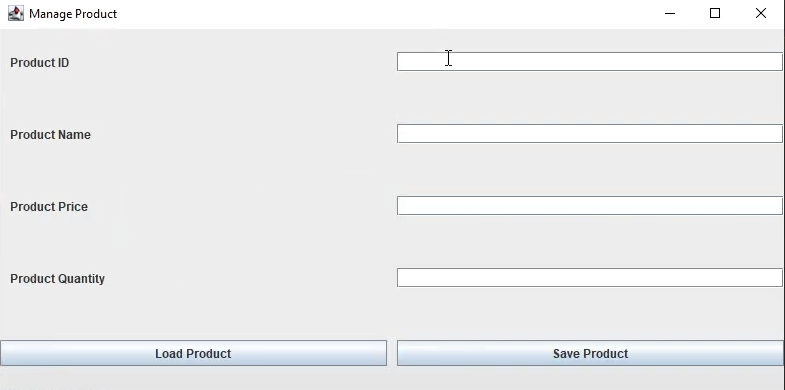

## Portfolio

---
### Personal Information
<a href="https://docs.google.com/document/d/1VNGgvt5y0JUfwl7vTFYej8uUigFgF54y/edit?usp=sharing&ouid=106513498366773797958&rtpof=true&sd=true">Click Here for Resume</a>

#### Education
- Currently fully-focused on graduating as <abbr title= "Computer Science">CS</abbr> major in Auburn University 2022 Winter
- Previously enrolled as Chemistry Major in Ursinus College and <abbr title= "Chemical Engieerning">CHEN</abbr> Major in Auburn University
 
#### Career
- Looking for Full-time Computer Science/Software Development related jobs
- Interested in Front-end development and Gaming design

#### Programming Languages
- Java, MATLAB, C++, Swift, SQL, HTML, Python, R

---

### Projects

[IOS APP - EinDecider]

Have you ever got annoyed by overthinking some tiny decisions in your life?
This is EinDecider, a little app that will help do it for you.
Just a few taps, then your decision is made.
You could pick a variety of tools like dice and wheel of foturne to decide.
The beta test link of application is below.

<a href="http://testflight.apple.com/join/7jpiiCaV">Click Here For Beta Test</a>

---
[Basic Store software - Java/SQL]

This is a simple store application implemented by Java and SQL.
The demonstration of the application is shown below.

<a href="https://youtu.be/6gTvhO-yf8A">Project Demonstration Video</a>

---
[MATLAB Projects]

This is a chemical engineering project that applied the Monte Carlo method 
to simulate molecules bonding, diffusion and reaction.
Code is implemented mainly by myself using the optimized algorithm 
We came up with which speeds up the simulation 10 times faster than the original code.
The MATLAB code and memorandum is linked below.

<a href="https://drive.google.com/file/d/1KQZWLTnoYie4cceFBCERvQxVZdjsGuG_/view?usp=sharing">MATLAB CODE</a>

<a href="https://drive.google.com/file/d/185TY-MZDcOt2dn_rTamlDS2knvcWF_TE/view?usp=sharing">Project Memorandum</a>

---
You have reached the bottom

---
