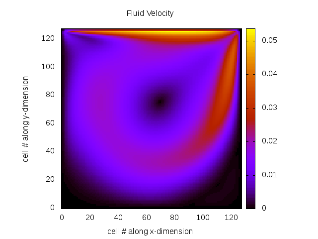

# Portfolio

## [CV](https://github.com/hw16471/hw16471.github.io/blob/master/pdf/Harry%20Waugh%20-%20Jan%202019.pdf)
The lastest version of my CV can be downloaded [here](https://github.com/hw16471/hw16471.github.io/blob/master/pdf/Harry%20Waugh%20-%20Jan%202019.pdf).

## [Computer Graphics Raytracer](https://github.com/ainsleyrutterford/UOB_Raytracer)
<div style="width:100%;height:0px;position:relative;padding-bottom:58.044%;">
  <iframe src="https://streamable.com/s/rn875/wxuqhg" frameborder="0" width="100%" height="100%" allowfullscreen style="width:100%;height:100%;position:absolute;left:0px;top:0px;overflow:hidden;">
  </iframe>
</div>
<br>
### Overview
This project involved building a Real-Time Raytracer from scratch using OpenCL, GLM and SDL. As can be seen above, this raytracer was used to render the [Cornell Box](https://en.wikipedia.org/wiki/Cornell_box) where phenomena such as reflection and refraction have been showcased. The realism of the rendered image was improved further using anti-aliasing and soft shadows. Other Cornell Box Scenes are shown in:
* [scene1](https://streamable.com/1mugn)
* [scene2](https://streamable.com/kwoa2)
* [scene3](https://streamable.com/phfs2)


### Compile and Run
```bash
git clone git@github.com:ainsleyrutterford/UOB_Raytracer
cd UOB_Raytracer
source clean_build.sh
```
Requirements: A GPU, OpenCL, GLM, and SDL2

### Technologies 
* C
* OpenCL
* OpenGL Mathematics (GLM)
* Simple DirectMedia Layer (SDL2)

---
## [Parallel Optimisations of a Lattice Boltzmann Code](https://github.com/hw16471/UOB_OpenCL_LBM)

### Overview
This project was all about learning how to exploit different hardware to improve the runtime of a Lattice Boltzmann code, which is widely used for simulating fluid dynamics. Popular programming platforms like MPI, OpenMP and OpenCL were all tested in various different combinations. The most efficient of these was OpenCL or MPI+OpenCL, which utilised one or more GPU configurations respectively. If you want know more about this, please read the [article](https://github.com/hw16471/UOB_OpenCL_LBM/blob/master/submission/report.pdf) I wrote.
### Compile and Run
```bash
git clone git@github.com:hw16471/UOB_OpenCL_LBM
cd UOB_OpenCL_LBM/submission
make
./d2q9-bgk ../input_128x128.params ../obstacles_128x128.dat
```
Requirements: A GPU, OpenCL

### Technologies 
* C
* OpenCL
* MPI
* OpenMP

---
## [Web Technologies](https://github.com/hw16471/UOB_Web_Tech_CW)

### Overview

### Compile and Run
```bash
git clone git@github.com:hw16471/UOB_Web_Tech_CW
cd UOB_Web_Tech_CW/site
node server.js
```
Requirements: NodeJS and Packages found in packages.json

### Technologies 
* HTML ( Dynamically created using Pug.js )
* Javascript ( JQuery, Ajax )
* CSS 
* NodeJS Server with embedded SQLite3 database

---

## [Thesis: Using Sensor Fusion and Deep Learning to Improve Activity Tracking](https://github.com/hw16471/ActivityTrackingWithSensorFusion)

### Overview

### Compile and Run
To train model with test data:
```bash
git clone git@github.com:hw16471/ActivityTrackingWithSensorFusion
cd ActivityTrackingWithSensorFusion
python deep_learning.py
```
Requirements: A GPGPU, Python, Tensorflow_GPU, NumPy, Keras

### Technologies 
* Python
* NumPy, SciPy and Pandas
* Tensorflow
* Keras

---

## [Detecting Dartboards](https://github.com/hw16471/UOB_DartboardDetector)

### Overview

### Compile and Run
```bash
git clone git@github.com:hw16471/UOB_DartboardDetector
cd UOB_DartboardDetector/finalversion
make all
./output
```
Requirements: CPP and OpenCV

### Technologies 
* C++ 
* OpenCV

---


## [Applied Security](https://github.com/hw16471/AppliedSecurity)

### Overview

### Compile and Run
Attacks require a scale-board, or dat file containing it's traces. If this can be obtained, 
attacks can be run with:
```bash
git clone git@github.com:hw16471/AppliedSecurity
cd AppliedSecurity/39824/scope
make parallel_attack.py
```
Requirements: A scale-board.


### Technologies 
* C
* Python
* Multiprocessing and NumPy packages

---
