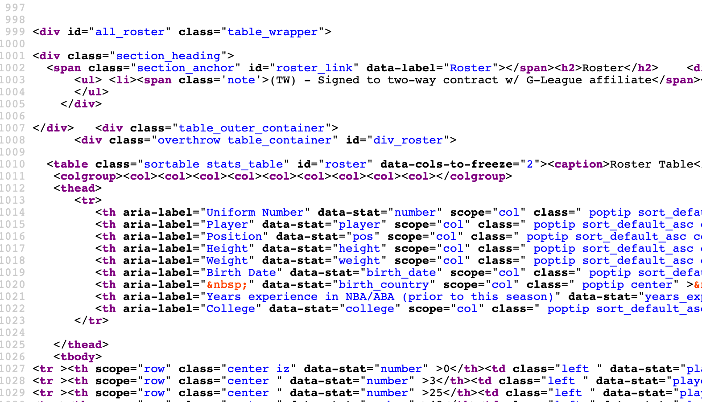

## Exploring Data Through Basketball
#### Getting to know the data science lifecycle with NBA data.
##### "Written by: Jennifer Grant"

```{r, include=FALSE}
library(dplyr)
library(ggplot2)
library(dplyr)
```

I graduated from UC Berkeley in May of 2020 with an undergraduate degree in Applied Mathematics. What an interesting time to be sent off into the world - during a global pandemic! One lesson I've discovered early on in post-graduation is that having a degree opens doors, but whether or not you're chosen to step through one is dependent upon the projects you choose to work on. Projects **outside of classwork** are your opportunity to show a potential employer that you are interested in their work and have put thought into their business problems/research questions. I go out of my way to bold **outside of classwork** because you'd chuckle if you compared your resume with your peers. You'll see that all of you write about the exact same class projects. Luckily, with data science, working on your own passions project is easier than ever before because there is good quality data conveniently availabe online. I know, I know - where do you even begin when working on a solo project!? I worked on a data science project this summer that I hope can give future employers a glimpse at my ability to work through the data science lifecycle and to showcase my coding style. I want to share my experience with you so that you can see how, as a student with limited experience, you can easily use tools learnt in the classroom to expand your portfolio for employment after graduation. 

### Project Introduction

Althought I graduated from Berkeley, I haven't always lived in the bay area. Before this I lived in San Diego for 6 years, and during my time there I got to experience the football frenzy. I'm used to die-hard sports fans - I'm from Canada and Canadians LOVE their hockey. But I just didn't know enough about football to get involved, and I'm trying to make more of an effort to become apart of the sport culture in the United States. What's different about the sports culture in northern California, at least from my perspective, is that people are more into basketball. Maybe because there is a top team in the bay area (Golden State Warriors)? I don't know - but what I do know is that Basketball is so embedded into the Bay Area culture that, if you take any data science class at UC Berkeley, you'll almost certainly work with/talk about NBA datasets. So, after my junior year at Berkeley I knew that I needed to drink the NBA kool-aide, and this project is an extension of my kool-aide-drinking epiphany. I'll be working with NBA data spanning ten seasons (2009-2019) and focusing on hypothesis questions about how salaries relate to team performance. The questions I'm asking in this project are:

1. Do teams with high salaries tend to win more games?

2. Do teams with younger, less experiences players tend to have lower salaries?

3. How have team salaries changed over the last ten seasons? Very rapidly? Remained somewhat constant? Or decreased?

I share my code and experience working through the data science lifecycle, from data aquisition to data cleaning to data exploration to published visualizations using R's incredible Shiny App package. I also have a video [here](https://youtu.be/hsHwMV5i2gM) you can watch that introduces my project, my data source, my Shiny App code, and my final published Shiny App visualizations. So strap in and let's begin!


### Data Prep

In my opinion, there are two main stages of prepping data: acquiring your data & cleaning your data for future analysis. I used to think that acquiring data from onlie sources was a bit scary, but once you do it a couple times you start to become more comfortable with the process. I do my best in this project to explain and show my code for each step to provide more guidance. Alright, Let's dive in!

##### Data Acquisition

The challenge around any data project is finding your data source. Sometimes this part will actually dictate what kind of project you end up choosing to do. Luckily, with sports, there are a plethora of sources for game/team data. All of my data comes from [Basketball Reference] (https://www.basketball-reference.com/), a great source for any team-related data and statistics. 

Now that I know where my data is going to come from, the next step is usually figuring out how to ingest that data, whether through scraping a webpage directly or by download some sort of data file like a csv (**c**omma **s**eparated **v**alues). It's during this step that you need to reflect on how to keep your data files **organized**! This may seem irrelevent for small projects, and I've definitely gotten away without doing so, but from experience once you start working on complex projects you'll quickly find that keeping your files organized is imperative for your sanity. Staying organized is a habit, so my advice is to start early and often, and to practice file organization even for small projects. Since my project will be asking questions around salary for ten seasons (2009-2019) staying organized with my files is going to be really important. Below I'm sharing a rough diagram of how I usually choose to keep my files organized for a larger project, so feel free to use the same schematic for yours! 


```{r, echo=FALSE, fig.align='center'}
DiagrammeR::grViz("digraph {
  graph [layout = dot, rankdir = TB]
  
  node [shape = rectangle]        
  rec1 [label = 'Project Name']
  rec2 [label = 'data']
  rec3 [label =  'code']
  rec4 [label = 'reports']
  rec5 [label = 'raw data']
  rec6 [label = 'clean data']
  rec7 [label = 'download_html_files.py']
  rec8 [label = 'scraping_tables.py']
  rec9 [label = 'nba_report.html']
  rec10 [label = 'nba_report.rmd']
  
  # edge definitions with the node IDs
  rec1 -> rec2 
  rec1 -> rec3 
  rec1 -> rec4
  rec2 -> rec5
  rec2 -> rec6
  rec3 -> rec7
  rec3 -> rec8
  rec4 -> rec9
  rec4 -> rec10
  }", 
  height = 200)
```


Now that I have my file schematic, let's talk about Hypertext Markup Language (HTML) files. HTML is the language used in documents that makeup a webpage. Since I'm working with online data (and maybe you too), it's important to get comfortable with how data is formatted online using html files. Figure 1 below shows an example html file for the Toronto Raptors' homepage on Basketball Reference. If you want to look at a webpage's html file on a Mac, just hold control as you click anywhere on the page and select *View Page Source*. With a quick google search you can find the same operation for Windows.


```{r html_example, echo=FALSE, fig.align='center', fig.cap="Figure 1 - Example HTML page from Basketball Reference under Toronto Raptors team statistics", out.width = '50%', out.height='50%'}
knitr::include_graphics("html_example.png")
```


I decided to actually downloaded the html files that make up each team's homepage on Basketball Reference and saved them on my local laptop. I did this because I knew that I would need data from multiple tables on each team's homepage, and so I didn't want to overwhelm the website with data requests (yes, you can crash a website for sending too many requests, which can come along with legal trouble). Downloading HTML pages from the web is quite easy! Once I found the common pattern emerging from all the urls, it's easy to download each file with a basic for-loop. Can you see the pattern from the sample urls below?

https://www.basketball-reference.com/teams/TOR/2010.html \
https://www.basketball-reference.com/teams/ATL/2011.html \
https://www.basketball-reference.com/teams/GSW/2012.html

They're basically the same, except for the team abbreviation and season. Easy for loop material! I share all of my code below so that you can possibly do this with your own project. If you're not familiar with R utilities, I use both *dir.exist* and *dir.create* to check whether a file first exists on my local laptop (dir=directory=folder) before creating it, and I use *download.file* to download the html file to a folder on my laptop (destfile). It really doesn't have to be that scary!

```{css, echo=FALSE}
pre {
  max-height: 300px;
  overflow-y: auto;
}

pre[class] {
  max-height: 300px;
}
```

```{r, eval=FALSE}
# common url
basketref <- 'https://www.basketball-reference.com'

# 30 NBA team abbreviations
team_names <- c(
  'ATL', 'BOS', 'BRK', 'CHI', 'CHO', 'CLE', 'DAL', 'DEN', 'DET', 'GSW',
  'HOU', 'IND', 'LAC', 'LAL', 'MEM', 'MIA', 'MIL', 'MIN', 'NOP', 'NYK',
  'OKC', 'ORL', 'PHI', 'PHO', 'POR', 'SAC', 'SAS', 'TOR', 'UTA', 'WAS'
)

# number of teams - need for loop
num_teams <- length(team_names)

# vector of seasons - need for loop
seasons <- 2010:2019


# downloading html documents into subdirectory 'rawdata/html-files/year'
for (year in seasons) {
  
  # make sure subdirectory for each season exists and if not yet, create it
  subdir <- paste0("rawdata/html-files/", year)
  if (!dir.exists(subdir)) {
    dir.create(subdir)
  }
  
  for (team in 1:num_teams) {
    
    # below's sequence of if-statements account for name changes among certain 
    # teams during seasons 2009-2019
    if (year <= 2012 & team_names[team] == 'BRK') {
      print(paste('downloading html file for NJN (former BRK)', 
                  year))
      url_doc <- paste0(basketref, '/teams/NJN/', year, '.html')
    } else if (year <= 2014 & team_names[team] == 'CHO') {
      print(paste('downloading html file for CHA (former CHO)', 
                  year))
      url_doc <- paste0(basketref, '/teams/CHA/', year, '.html')
    } else if (year <= 2013 & team_names[team] == 'NOP') {
      print(paste('downloading html file for NOH (former NOP)', 
                  year))
      url_doc <- paste0(basketref, '/teams/NOH/', year, '.html')
    } else {
      print(paste('downloading html file for', team_names[team], 
                  'season', year))
      url_doc <- paste0(basketref, '/teams/', team_names[team], 
                        '/', year, '.html')
    }
    
    # download
    download.file(
      url = url_doc,
      destfile = paste0('rawdata/html-files/', year, '/',
                        team_names[team], '-', year, '.html'))
  } # end looping through teams in season
  
} # end looping through all seasons
```

You'll notice a sequence of if-statements in the code above that's accounting for team name changes. Well, something cool I learnt during the downloading process is that Jay-Z is a minority owner of the Brooklyn Nets (BKN) and that they used to play in New Jersey under the name The New Jersey Nets (NJN). I don't know why, but I feel much cooler for knowing this. Alright, now that downloading is complete, onto extracting the data - or "scraping"!

Personally, scraping an HTML file or a webpage directly can be overwhelming at first because of the sheer amount of lines involved, but it helps to understand the structure of HTML. I found [this](https://www.w3schools.com/html/html_intro.asp) resource especially helpful. There is a menu bar on the left side that lists all of the possible components of an HTML file, like how to create and store information in an HTML table. For my project I need to scrape the Roster table for player names and experience, the Misc table for team wins and losses, the Totals table for total points scored, and last but not least the Salaries table for each team's total salary. Since I know the exact tables, I can parse through the HTML file and find the id of the node containing my needed tables. Here's a picture showing the table node for the Roster table if you're interested:

```{r roster_html_example, echo=FALSE, fig.align='center', fig.cap="Figure 2 - Roster table for Toronto in html format", out.width = '50%', out.height='50%'}

```

There are a couple different libraries in R that you can use to scrape through an html file. I use the XML library so that I can access the *readHTMLtable* function. Read the documentation for this method [here](https://cran.r-project.org/web/packages/XML/XML.pdf) - use the menu on the left to scroll to readHTMLtable. This is the function I use to extract table data from the html files into a dataframe. Once we have a dataframe, it's easy to save the data as a csv file for future analysis. Since this part in data science project tends to be the overwhleming part (even for me, but it gets better with practice, I promise!) I want to walk through my lines of code that deal with scraping tables using "pseudocode", which is basically a series of statements explaning what the code is doing. Starting at the for loop iterating over each team in a given season:

- read the html document into a character vector using *readLines*, with each line in the file being its own element in the vector
- grab the line number (or index) in the character vector that contains the string 'id = "*insert_table_name*"' using R's *grep* function - this will indicate where to start reading in the table
- initialize a separate variable (line_counter) to keep track of how many lines the table has
- find the line number (or index) where the table ends by looping through the html document (keeping track of lines with line_counter) until we reach the string "</table>" which signals the end of an HTML table
- now that we have the starting index (begin_table) and the ending index (line_counter), read these exact lines from the html file using XML's *readHTMLtable* into a datafrmae
- create a folder name where we can save the data in the dataframe
- save dataframe as a csv file in designated folder

Hopefully the pseudocode above, along with the heavily documented code below, will help you in understanding how to perform the same process for your own project. The more you do it, the less scary it becomes.

```{r, eval=FALSE}
#load our needed library
library(XML)

# make sure subdirectories exist inside 'rawdata/'- if not, create them
data_dirs <- c("roster", "totals", "salary", "team_misc")

for (d in data_dirs) {
  subdir <- paste0("rawdata/", d)
  if (!dir.exists(subdir)) {
    dir.create(subdir)
  }
}


# name abbrevitions of 30 NBA teams
team_names <- c(
  'ATL', 'BOS', 'BRK', 'CHI', 'CHO', 'CLE', 'DAL', 'DEN', 'DET', 'GSW',
  'HOU', 'IND', 'LAC', 'LAL', 'MEM', 'MIA', 'MIL', 'MIN', 'NOP', 'NYK',
  'OKC', 'ORL', 'PHI', 'PHO', 'POR', 'SAC', 'SAS', 'TOR', 'UTA', 'WAS'
)

seasons <- 2010:2019


# extract html tables Roster, Totals, Salaries, and Misc for each season
for (year in seasons) {
  
  # make sure year folder exist inside subdirectories - if not create it
  for (d in data_dirs) {
    subdir <- paste0("rawdata/", d, '/', year)
    if (!dir.exists(subdir)) {
      dir.create(subdir)
    }
  }
  
  # vector to hold name of team html files for this season
  html_files <- paste0(team_names, '-', year, '.html')
  
  # loop through each team for this season 
  for (team in 1:length(team_names)) {
    # Read html document (as a character vector) for a given team
    print(paste('scraping data for', team_names[team],
                'season', year))
    html_doc <- readLines(paste0('rawdata/html-files/', 
                                 year, '/', html_files[team]))
    
    # ====================================================
    # Scrape Roster table
    # ====================================================
    # initial line position of roster html table
    begin_roster <- grep('id="roster"', html_doc)
    # find the line where the html ends
    line_counter <- begin_roster
    while (!grepl("</table>", html_doc[line_counter])) {
      line_counter <- line_counter + 1
    }
    # read in table as data.frame and export it as csv
    roster_tbl <- readHTMLTable(html_doc[begin_roster:line_counter])
    roster_csv <- paste0(team_names[team], '-', year, '-roster.csv')
    write.csv(roster_tbl, 
              file = paste0('rawdata/roster/', year, 
                            '/', roster_csv))
    
    # ====================================================
    # Scrape Totals table
    # ====================================================
    # initial line position of totals html table
    begin_totals <- grep('id="totals"', html_doc)
    # find the line where the html ends
    line_counter <- begin_totals
    while (!grepl("</table>", html_doc[line_counter])) {
      line_counter <- line_counter + 1
    }
    # read in table as data.frame and export it as csv
    totals_tbl <- readHTMLTable(html_doc[begin_totals:line_counter])
    totals_csv <- paste0(team_names[team], '-', year, '-totals.csv')
    write.csv(totals_tbl, 
              file = paste0('rawdata/totals/', year, 
                            '/', totals_csv))
    
    # ====================================================
    # Scrape Salaries table
    # ====================================================
    # initial line position of salaries html table
    begin_salaries <- grep('id="salaries2"', html_doc)
    # find the line where the html ends
    line_counter <- begin_salaries
    while (!grepl("</table>", html_doc[line_counter])) {
      line_counter <- line_counter + 1
    }
    # read in table as data.frame and export it as csv
    salaries_tbl <- readHTMLTable(html_doc[begin_salaries:line_counter])
    salaries_csv <- paste0(team_names[team], '-', year, '-salaries.csv')
    write.csv(salaries_tbl, 
              file = paste0('rawdata/salary/', year, 
                            '/', salaries_csv))
    
    # ====================================================
    # Scrape Misc table
    # ====================================================
    # initial line position of roster html table
    begin_misc <- grep('id="team_misc"', html_doc)
    # find the line where the html ends
    line_counter <- begin_misc
    while (!grepl("</table>", html_doc[line_counter])) {
      line_counter <- line_counter + 1
    }
    # read in table as data.frame and export it as csv
    misc_tbl <- readHTMLTable(html_doc[begin_misc:line_counter])
    misc_csv <- paste0(team_names[team], '-', year, '-misc.csv')
    write.csv(misc_tbl, 
              file = paste0('../data/rawdata/team_misc/', year, 
                            '/', misc_csv))
  } # end looping through teams
  
} # end loopinng through seasons

```


Now that I have all my data (yay!), I can start merging the columns I need from each table into a larger dataframe, and I'll show you how I clean the data at the same time. After cleaning, we get to the fun part - exploring!

##### Data Cleaning

This is the last part of the data prep stage, and usually the least enjoyable for most. This is where I will need to merge relevent columns from all of my tables and make some changes to the data so that I can use them for plotting later. I actually enjoy this part because it feels like a fun puzzle - I know what the outcome must be (e.g. tables merged, dates cleaned, names changed to lowercase, convert datatype, etc) and it's a creative process to get there. I'm lucky (or maybe unlucky?) in that there isn't much actual data cleaning to do here, so you'll see that I make the necessary changes (cleaning) when I merge features from different tables into one final MEGA detaframe.

To make this whole process seamless under one big code chunk, I always first test out what I want to do with each table (grab column and clean data in column) using just one team as a simpler case, and then generalize up from there. I find that breaking up a task where I'll need to iterate over a list/vector of objects (team, seasons, etc) helps with the debugging process and I'm better able to see how to generalize my code (similar to what we did in figuring out the pattern in team URLs earlier). I'll show you what I mean by starting with the Roster table. Below are the columns in the roster table:

```{r, echo=FALSE}
print(c('index', 'No.', 'Player', 'Position', 'Height', 'Weight', 
              'Birthdate', 'Country', 'Experience', 'College'))
```

To answer my hypothesis questions I'm going to need the "Experience" column. I'm also going to grab the number of players on each team in case I want to compute averages. 

It's during this merging process that I notcied the Roster table and the Salaries table have different players on them for each team. The Roster table has more players, with some not on the Salaries table. Since my project is around team salaries, I decide to only include players that are present on the Salaries table. So before I can grab the experience column, I'll need to filter out players from the Roster table that are not on the Salaries table. I can't stop here though, because notice the datatype and entries in the experience column:

```{r, echo=FALSE}
col_names = c('index', 'No.', 'Player', 'Position', 'Height', 'Weight', 
              'Birthdate', 'Country', 'Experience', 'College')

read.csv('../data/rawdata/roster/2010/ATL-2010-roster.csv', 
                  stringsAsFactors = FALSE, 
                  col.names=col_names)$Experience
```

Notice that the entries are all characters (strings) and a rookie player with "zero" experience is coded as an 'R' for Rookie. I want to sum up team experience, so I'll have to convert each entry to a numeric value using R's *as.numeric* function, but first I'll have to replace the "R" with "0". Doing this is actually quite easy. There are a couple ways to do this but I like to work with the stringr library when manipulating strings. The functions are easy to remember and are named really appropriately. Since I want to do a replacement of 'R' with '0', I use stringr's *str_replace_all* function. You'll notice in my code below that after grabbing the experience column and cleaning it, I save it into a larger vector that will eventually hold every team's summed experience when I generalize up with a for-loop. Note that I also import the dplyr library so that I can use some of its functions, like *select*.

```{r, eval=FALSE}
# we'll need both the dplyr and strinr libraries (stringr for cleaning strings:))
library(dplyr)
library(stringr)

#set column names
col_names <- c('index', 'No.', 'Player', 'Position', 'Height', 'Weight', 
              'Birthdate', 'Country', 'Experience', 'College')

# initialize a vector to hold each team's summed experience 
total_team_experience <- c()

#going to also grab number of players, in case we want to compute averages
num_players <- c()

#import roster data as a csv file
roster <- read.csv('../data/rawdata/roster/2010/ATL-2010-roster.csv', 
                  stringsAsFactors = FALSE, 
                  col.names=col_names)

#import salary data as a csv file
sal_col_names <- c('Index', 'Rank','Player', 'Salary')
salary_players <- read.csv('../data/rawdata/salary/2010/ATL-2010-salaries.csv',
                  stringsAsFactors=FALSE,
                  col.names=sal_col_names)$Player

#consider only the experience of those on the salary table
roster <- roster[roster$Player %in% salary_players, ]

# from this table we only want to extract the experience column
experience <- select(roster, 'Experience')

# we are going to eventually need the combined experience for each team, so we
# replace all Rookie (R) entries with 0 and then convert the entire column to a
# numeric datatype
experience$Experience <- as.numeric(str_replace_all(experience$Experience, 'R', '0'))

# append the sum of Atlanta's experience column to a larger vector planned to 
# hold all teams total experience; also append num of players to larger vector
total_team_experience <- c(total_team_experience, sum(experience$Experience))
num_players <- c(num_players, nrow(roster))
```

Sweet, we are done working with a simple case on the Roster table! 

To provide more guidance, I'll walk you through how I grabbed team salaries from the Salaries table, and then quickly show you the code for the last two tables. Here are the columns from the Salaries table:

```{r, echo=FALSE}
print(c('Index', 'Rank','Player', 'Salary'))
```

I'm only going to need the total salary for each team ("Salary"), but notice again the dataype and special characters in the Salary column:

```{r, echo=FALSE}
sal_col_names = c('Index', 'Rank','Player', 'Salary')
read.csv('../data/rawdata/salary/2010/ATL-2010-salaries.csv',
                  stringsAsFactors=FALSE,
                  col.names=sal_col_names)$Salary
```

We are again dealing with numbers that should be a numeric datatype but they've been stored as strings with the dollar ($) special character and a comma (,). Stringr has another handy dandy function called *str_remove_all* that lets you pick a pattern to be removed from a string. I used a regex pattern for this so that I can eliminate both the dollar sign and the comma in one go (see code for regex pattern). Once the special characters are removed and I'm only dealing with digits, I can again use R's *as.numeric* to convert to a numeric datatype. Check out my code for this below.

```{r, eval=FALSE}
#set column names
col_names <- c('Index', 'Rank','Player', 'Salary')

#initialize vectors to hold all the teams total salaries, as well as min & max in case I need it
salaries <- c()
salaries_min <- c()
salaries_max <- c()

#import data as a csv file
salary <- read.csv('../data/rawdata/salary/2015/CHI-2015-salaries.csv',
                  stringsAsFactors=FALSE,
                  col.names=col_names)

# remove the dollar symbol and commas so that we can convert the column to 
# a numeric datatype
salary$Salary <- as.numeric(str_remove_all(salary$Salary, regex('[\\$,]')))

#remove players with NA as salary
salary <- salary[!is.na(salary$Salary), ]

#remove players with 0 as salary 
salary <- salary[salary$Salary != 0, ]


# append the sum to the large vectore intended to hold all total salaries
salaries <- c(salaries, sum(salary$Salary))
salaries_min <- c(salaries_min, min(salary$Salary))
salaries_max <- c(salaries_max, max(salary$Salary))
```

I'm done with salaries and so I'll quickly show you how I grabbed total points, wins, and losses from the Totals and Misc tables. I pretty much use the same steps as above, but there is no cleaning involved so I'll skip the explanation. Check out the code chunks below.

```{r, eval=FALSE}
# ====================================================
# Totals table
# ====================================================
#
#set column names
col_names <- c('index', 'rank', 'player', 'age', 'games', 'games_started',
              'minutes_played', 'field_goals', 'field_goal_attempts', 
              'field_goal_%', '3P_field_goals', '3P_attempts', '3P_%', 
              '2P_field_goals', '2P_attempts', '2P_%', 'effective_FG_%', 
              'free_throws', 'free_throw_attempts', 'FT_%', 'offensive_rebounds', 
              'defensive_rebounds', 'total_rebounds', 'assists', 'steals', 
              'blocks', 'turnovers', 'personal_fouls', 'pts')

# initialize a vector that will hold all team total points
total_points <- c()

#import data as a csv file
totals <- read.csv('../data/rawdata/totals/2010/ATL-2010-totals.csv',
                  stringsAsFactors = FALSE,
                  col.names=col_names)

# append total points of Atlanta to vector - feature already numeric
total_points <- c(total_points, sum(totals$pts))
```

```{r, eval=FALSE}
# ====================================================
# Misc table
# ====================================================
#
#set column names
col_names <- c('index', 'label', 'wins', 'losses', 'PW', 'PL', 'MOV', 'SOS', 'SRS',
              'ORtg', 'DRtg', 'pace', 'FTr', '3PAr', 'eFG%', 'TOV%', 'ORB%', 
              'FT/FGA', 'eFG%2', 'TOV%2', 'DRB%', 'FT/FGA2', 'arena', 'attendance')

#initialize a vector that will hold all wins and losses for teams
wins <- c()
losses <- c()

# import misc csv file
misc <- read.csv('../data/rawdata/team_misc/2010/ATL-2010-misc.csv', 
                stringsAsFactors = FALSE,
                col.names=col_names)

#extract first element from each column (team win and losses)
wins <- c(wins, misc$wins[1])
losses <- c(losses, misc$losses[1])
```

Great! Now that I've practiced simpler cases for extracting data, let's put it all together into a function or for loop. Although a function would be more ideal, see how I generalized my code chucnks above into one big for loop:

```{r, eval=FALSE}
#we initialize column names for each table
roster_col_names <- c('index', 'No.', 'Player', 'Position', 'Height', 'Weight',
                     'Birthdate', 'Country', 'Experience', 'College')

salary_col_names <- c('Index', 'Rank','Player', 'Salary')
total_col_names <- col_names = c('index', 'rank', 'player', 'age', 'games',
                                'games_started', 'minutes_played', 'field_goals', 
                                'field_goal_attempts', 'field_goal_%', 
                                '3P_field_goals', '3P_attempts', '3P_%',
                                '2P_field_goals', '2P_attempts', '2P_%', 
                                'effective_FG_%', 'free_throws',
                                'free_throw_attempts', 'FT_%','offensive_rebounds',
                                'defensive_rebounds', 'total_rebounds', 'assists',
                                'steals', 'blocks', 'turnovers', 'personal_fouls', 
                                'pts')
misc_col_names <-  c('index', 'label', 'wins', 'losses', 'PW', 'PL', 'MOV', 'SOS', 
                    'SRS', 'ORtg', 'DRtg', 'pace', 'FTr', '3PAr', 'eFG%', 'TOV%', 
                    'ORB%', 'FT/FGA', 'eFG%2', 'TOV%2', 'DRB%', 'FT/FGA2', 'arena',
                    'attendance')

# we initialize vectors to hold our column data
total_team_experience <- c()
num_players <- c()
salaries <- c()
salaries_min <- c()
salaries_max <- c()
salaries_median <- c()
total_points <- c()
wins <- c()
losses <- c()

# set the file path to the data and initialize a vector that holds the file names
file_path <- '../data/rawdata/'
files <- c('roster', 'salary', 'totals', 'team_misc')

# initialize a vector with team names in abbreviated format
team_names <- c(
  'ATL', 'BOS', 'BRK', 'CHI', 'CHO', 'CLE', 'DAL', 'DEN', 'DET', 'GSW',
  'HOU', 'IND', 'LAC', 'LAL', 'MEM', 'MIA', 'MIL', 'MIN', 'NOP', 'NYK',
  'OKC', 'ORL', 'PHI', 'PHO', 'POR', 'SAC', 'SAS', 'TOR', 'UTA', 'WAS'
)

# need list of seasons
seasons <- 2010:2019

for (file in files) {
  for (season in seasons) {
    
    # do correct set of operations based on the file
    if (file == 'roster') {
      col_names <- roster_col_names
      
      for (i in 1:length(team_names)) {
        #grab the right file and column
        roster <- read.csv(paste0(file_path, file, '/', season, '/', 
                                     team_names[i], '-', season, '-', file, 
                                     '.csv'), 
                              stringsAsFactors = FALSE, 
                              col.names=col_names) 
        
        #import salary data as a csv file
        sal_col_names <- c('Index', 'Rank','Player', 'Salary')
        salary <- read.csv(paste0(file_path, 'salary', '/', season, '/', 
                                     team_names[i], '-', season, '-salaries.csv'),
                  stringsAsFactors=FALSE,
                  col.names=sal_col_names)
        
        #cleaned salary column & remove some erroneous entries (more explanation on these below)
        salary$Salary <- as.numeric(str_remove_all(salary$Salary, regex('[\\$,]')))
        salary <- salary[!is.na(salary$Salary), ]
        salary <- salary[salary$Salary != 0, ]
        salary_players <- salary$Player
        
        ###consider only the experience of those on the salary table
        roster <- roster[roster$Player %in% salary_players, ]
        experience <- roster %>% select('Experience')
        
        #clean the experience column
        cleaned_experience <- as.numeric(str_replace_all(experience$Experience, 'R', 
                                                        '0'))
        #append to our vector
        total_team_experience <- c(total_team_experience, 
                                  sum(cleaned_experience))
      }
      
    } else if (file == 'salary') {
      col_names = salary_col_names
      
      for (i in 1:length(team_names)) {
        #grab the right file
        salary <- read.csv(paste0(file_path, file, '/', season, '/', team_names[i], 
                                 '-', season, '-salaries.csv'),
                  stringsAsFactors=FALSE,
                  col.names=salary_col_names)
        
        #cleaned salary column
        salary$Salary <- as.numeric(str_remove_all(salary$Salary, regex('[\\$,]')))
        
        #remove players with 0 as salary and then count how many players remain for
        # our official team headcount
        
        #first, we remove players with NA as salary; this is only for one player
        # on the chicago bulls team for season 2015 who's contract got waived - 
        # he is not present on the roser list for this particular year so there
        # is no need to subtract his headcount from number of players
        salary <- salary[!is.na(salary$Salary), ]
        
        #then remove players with zero salary
        salary <- salary[salary$Salary != 0, ]
        
        # append the sum and min, max to our vectors
        salaries <- c(salaries, sum(salary$Salary))
        salaries_min <- c(salaries_min, min(salary$Salary))
        salaries_max <- c(salaries_max, max(salary$Salary))
        salaries_median <- c(salaries_median, median(salary$Salary))
        num_players <- c(num_players, nrow(salary))
      }
      
    } else if (file == 'totals') {
      col_names <- total_col_names
      
      for (i in 1:length(team_names)) {
        #grab the right file
        totals <- read.csv(paste0(file_path, file, '/', season, '/', team_names[i], 
                                 '-', season, '-', file, '.csv'),
                          stringsAsFactors = FALSE,
                          col.names=col_names)
        
        # append total points to vector
        total_points <- c(total_points, sum(totals$pts))
      }
      
    } else {
      col_names <- misc_col_names
      
      for (i in 1:length(team_names)) {
        # grab the right file
        misc <- read.csv(paste0(file_path, file, '/', season, '/', team_names[i], 
                                 '-', season, '-misc.csv'), 
                        stringsAsFactors = FALSE,
                        col.names=col_names)
        
        #extract first element from each column (team win and losses)
        wins <- c(wins, misc$wins[1])
        losses <- c(losses, misc$losses[1])
      }
    }
  } #end seasons
} #end files
```

...and with a few last touches...

```{r, eval=FALSE}
# build vector for seasons - essentially repeat all season entries 30 times for
# each team
season_col = rep(seasons, each = 30)

#build vector for team names column - same as above but repeated 10 times
# in a different way
teams_col = rep(team_names, times = 10)

#build our final dataframe!
nba_frame = data.frame(season_col, teams_col, total_team_experience, num_players, salaries,
                       salaries_min, salaries_max, salaries_median, total_points, wins, losses, 
                       stringsAsFactors = FALSE)

names(nba_frame) = c('season', 'team', 'total_experience', 'num_players', 'total_salaries',
                     'min_salary', 'max_salary', 'median_salary', 'total_points', 'wins', 'losses')
```

...we have the final product - my clean MEGA dataframe!

```{r, echo=FALSE}
nba = read.csv('../data/clean_data/nba_frame.csv', stringsAsFactors = FALSE) %>% select(!c('X'))
format(head(nba, 5))
```

Let's move onto my favorite part of the data science lifecycle:)

### Exploratory Data Analysis (EDA)

This is where the fun part begins! I can hardly contain my excitement after all the work put into prepping the data - a sure sign that I love this part of the cycle. 

If you don't already have questions you want to answer with your data, it can be hard to find a place to start. The best way to start is to explore your features. Since my primary questions for this report center around salary, I explore the distribution of team salaries to see how they've changed throughout the last ten seasons. I love the ggplot2 library and so you'll see all of my plots are generated using it. Check out salary distribution below.

```{r, fig.align="center"}
nba %>% ggplot(aes(total_salaries / 1000000)) + geom_histogram(bins=10, color='white') + facet_wrap(~season, nrow=2) + theme_bw() +  theme(axis.text.x = element_text(angle=50, hjust=1)) + xlab('Total Salary (millions)')
```

One major detail that pops out right away: the gradual increase of team salaries over time. We can see the salary distribution start close to the left end of each plot in earlier seasons, and then gradually shifts toward the higher end. I don't know about you, but wht immediately comes to mind is whether or not this shifting is merely due to inflation, or an actual shift in higher salaries over time. Since adjusting for inflation isn't challenging, I decide to make this adjustment for a more robust analysis. Note that when adjusting salaries, you need to pick a base year to adjust all salaries back to using the Consumer Price Index (CPI), which is availble [here](https://www.usinflationcalculator.com/inflation/consumer-price-index-and-annual-percent-changes-from-1913-to-2008/). I share all of my code for this adjustment below if you're curious.

```{r}
#' @tital Adjust Income
#' @description converts a given vector of salaries for a given year into 2010 dollars
#' @param salary vector of salaries for the same year
#' @param year_CPI is a double that represents the average Consumer Price Index for year of salary
#' @output returns the vector of salaries in terms of 2010 dollars
adjust_income <- function(salary, year_CPI) {
  CPI_2010 <- 218.056
  adjusted_salary <- salary * (CPI_2010 / year_CPI)
  
  return(adjusted_salary)
}
```

```{r}
#initialize a vector that will hold all of our new adjusted salaries
adjusted_salaries <- c()

#vector of seasons for which we need to adjust their salaries
seasons_to_adjust <- 2011:2019

#since we aren't adjusting 2010 since we are considering that our base
# in this analysis, we need to add these values to our adjusted salaries
# because we will be adding this as a feature to our dataframe
salaries_2010 <- nba[nba['season'] == 2010, ][['total_salaries']]
adjusted_salaries <- c(adjusted_salaries, salaries_2010)

# initialize a vector that holds average yearly CPI values from website linked above
# for the years 2011-2019
yearly_CPI <- c(224.939, 229.594, 232.957, 236.736, 237.017, 240.007, 245.120, 251.107, 255.657)

#now lets adjust all the other seasons down to our base dollars
for (i in 1:length(seasons_to_adjust)) {
  this_season <- nba[nba['season'] == seasons_to_adjust[i], ]
  this_season_salaries <- this_season[['total_salaries']]
  adjusted_salaries <- c(adjusted_salaries, adjust_income(this_season_salaries, yearly_CPI[i]))
}

#add feature to nba dataframe
nba['adjusted_salaries'] <- adjusted_salaries
```

We can see in the plot below that our adjustment worked - the distribution of adjusted salaries (in red) moves further to the left as time progresses away from the 2009-2010 season. 

```{r, fig.align='center'}
nba %>% ggplot(aes(total_salaries / 1000000)) + geom_density(color='blue') + geom_density(aes(adjusted_salaries / 1000000), color='red') + facet_wrap(~season, nrow=2) + theme_bw() +  theme(axis.text.x = element_text(angle=50, hjust=1)) + xlab('Total Salary (millions)') + labs(title='Distribution of Salaries both Adjusted and not Adjusted for Inflation') 
```

Wonderful! I won't show you this part, but I actually explored the distribution of all my features. It's just good to become familiar with your data and how it varies for each feature. Okay, I think I'm ready to start exploring my hypothesis questions. For your convenience I replicate them here:

1. Do teams with high salaries tend to win more games?

2. Do teams with younger, less experiences players tend to have lower salaries?

3. How have team salaries changed over the last ten seasons? Very rapidly? Remained somewhat constant? Or decreased?

I'll start with the first one and go in order. 

#### Salaries and Games Won

My frist question: Do teams with higher salaries tend to win more games?

In order to make inferences based on my data around this question, I'll need to access the necessary features: adjusted salaries and games won. I look at a scatter plot of these features to see if there is any sort of trend. See for yourself below.

```{r, fig.align="center"}
nba %>% ggplot(aes(x=wins, y=total_salaries / 1000000)) + geom_point()  + facet_wrap(~season, nrow=2) + theme_bw() + ylab('Total Salary (millions)') + xlab('Wins') + geom_smooth(method='loess', se=FALSE, formula=y~x)
```

Notice the blue line on each plot. This is called a loess curve or [loess regression](https://blogs.sas.com/content/iml/2016/10/17/what-is-loess-regression.html). I'm normally used to seeing a linear regression line on scatterplots, but loess regression can show more localized trends in data using a nonparametric technique. Without the curve, we can somewhat see a general positive correlation between the variables but it's not as obvious, so I was advised to explore what a loess curve could show. Overall, looking at this visualization, we can infer there is a positive trend between a team's salary and games won, especially in more recent seasons. 

Let's move on to my second question.

#### Salaries and Experience

My second question: Do teams with younger, less experienced players tend to have lower salaries? 

I expect to see a correlation between experience and salaries because I usually see older, more seasoned NBA players getting paid the most. To answer this question I will need to access total team experience and total salary features. Check out the scatterplot below.

```{r, fig.align="center"}
nba %>% ggplot(aes(x=total_experience, y=adjusted_salaries / 1000000)) + geom_point()  + facet_wrap(~season, nrow=2) + theme_bw() + ylab('Total Salary (millions)') + xlab('Total Experience (years)') + geom_smooth(method='lm', se=FALSE) 
```

I decided to stick to linear regression for this plot because a linear relationship between these variables is much more obvious. It's easy to calculate the correlation coefficient ($R^{2}$) for each plot to see just how strong the correlation is between them. Check out my code and the coefficients below. 

```{r}
#' @title Seasonal R_squared
#' @description given two different feature labels, computes the correlation coefficient for all seasons between the years 2010-2019
#' @param y_label is the label of the feature on the y_axis
#' @param x_label is the label of the feautre on the x_axis
#' @output vector of correlation coefficients between labels for seasons 2010-2019
seasonal_rsquared = function(y_label, x_label) {
  #build a sequence that will help us navigate the dataframe by season
  season_starts <- seq(1, 300, 30)
  
  #initialize a vector to hold all ten season r_squared values
  r_squares <- c()
  
  #compute and collect seasonal r_squared values
  for (i in season_starts) {
    r_square <- summary(lm(nba[y_label][i:(i+29), ]~nba[x_label][i:(i+29), ]))$r.squared
    r_squares <- c(r_squares, r_square)
  }
  
  return(r_squares)
}
```

```{r}
#lets call the function we created above to compute our seasonal r_squared values
r_squares <- seasonal_rsquared('adjusted_salaries', 'total_experience')

#lets build a dataframe to hold the correlation coefficients for each season
seasons <- 2010:2019
r_squared <- data.frame(seasons, r_squares)
colnames(r_squared) <- c('season', 'r_square')
r_squared
```

I can see that some seasons show a more tight correlation between team experience and total salary, but overall I can infer that yes, less experienced teams tend to have a lower team salary. I can also infer that teams with more experienced players tend to have a higher total salary. 

Time to move on to my last hypothesis question.

#### Change in Salaries

My last question: How have team salaries changed over the last ten seasons? Have they remained relatively constant? If they have changed, how rapidly? 

To answer this, lets look at line plot for each team showing how team salaries have changed througout the last ten seasons.

```{r, fig.width = 10, fig.height=6}
nba %>% ggplot(aes(x=season, y=adjusted_salaries / 1000000)) + geom_line() + geom_point(aes(x=season, y=adjusted_salaries/ 1000000)) + facet_wrap(~team) + theme_bw() + theme(axis.text.x = element_text(angle = 90)) + ylab('Total Salary (millions)') + scale_x_continuous(breaks=2010:2019)
```

Interesting trends...

I can definitely say that salaries have not remained constant. I can see that in the earlier seasons (2010-2016) there are some weird up and down trends for all teams. But, aside from maybe a couple teams, salaries seem to increase at a  much faster rate beyond the 2015-2016 season. What I love most about the exploration part of the data science lifecycle is that when I see a common, sudden trend in data I love exploring historical information for context. Sure enough, there was a salary cap change that occurred around the 2016-2017 season that allowed teams to spend more money on players. Read [here](https://en.wikipedia.org/wiki/NBA_salary_cap) for more info on salary caps for the NBA if you're interested! Now back to my hypothesis question. I would say that based on the plot above, salaries have generally increased over time, with a more drastic increase happening beyond the 2015-2016 season.

I can't believe the exploration portion is over alredy. I did much more exploration than what I'm showing you here, but my focus was to show you how I go about answering hypothesis questions using informative visualizations. 

Alright, it's time for the reporting aspect of the data science lifecycle. This "blog" post is essentially my report, but there is also another final deliverable that I mentioned at the beginning - publishing a web app visualization using R's [Shiny App](https://shiny.rstudio.com/). I cover this in the reporting section that follows:)

### Report

If you've ever worked with building Graphical User Interfaces (GUIs), then you'll absolutely love R's Shiny App. I won't go into too much detail about Shiny App, but [here's](https://vimeo.com/131218530) a video that breaks down the main structure needed for a shint app in a really clear way. It's essentially a package in R that helps you build an interactive visualization, meaning someone viewing your visualization can chose what data they want to see and add/remove any additional aesthetics to the plot. If you've never worked with building GUIs - no worries - watch the video linked above and follow the rest of the reporting section to see how I go about building my shiny apps. 

When thinking about an iteractive visualization, it's important to identify what you consider as "inputs" and "outputs". What I mean by this is you need to decide how a user can interact with your visualization - drop down menu to choose data? Buttons to add additional lines to plot? Checkboxes to add or remove aesthetics like medians and averages? Once you understand the general layout, it's easy to target your inputs (whatever a user can control) and your outputs (plot change based on a user's input). I'll show you with my own code. 

I'll start with my most basic shiny app. I want to make an interactive visualization that shows where a specific team's salary lies each season relative to the teams with the lowest salary and the highest salary for that season. My input is going to be a drop down menu where the user can select which team they want to look at. The output will be a line plot over ten seasons with the user-selected team against the teams with the lowest and highest salaries. 

Similar to how I started with extracting a column and cleaning the column for a single team, I'm going to do the same here. I pick Atlanta as an example and build the static plot I want. From there I'm able to generalize out for any team selected by a user. See my code for the single static plot:

```{r, fig.align='center'}
### Building basic shiny app plot for Atlanta only

#variable to hold team name for customized plotting
team_name = 'Atlanta'

#grab rows for Atlanta
team = nba[nba['team'] == 'ATL', ]

#create two dataframes, one with the minimum salaries for each season and other max salaries
min_by_season = nba %>% group_by(season) %>% summarise('min'=min(adjusted_salaries))
max_by_season = nba %>% group_by(season) %>% summarise('max'=max(adjusted_salaries))

#now build customized line plot
ggplot() + geom_line(data=team, aes(x=season, y=adjusted_salaries / 1000000)) + 
  geom_line(data=min_by_season, aes(x=season, y=min / 1000000), color='red') + 
  theme_bw() + 
  ylab('Total Salary (millions)')  + 
  geom_line(data=max_by_season, aes(x=season, y=max / 1000000), color='blue') + 
  theme_bw() + 
  ylab('Total Salary (millions)') + 
  scale_x_continuous(breaks=2011:2019) +
  labs(title=paste0('Comparing ', team_name, "'s Salary"), subtitle="Comparisons are done for seasons 2010-1019 with teams having the lowest/highest salaries for that season") + 
  theme(plot.title = element_text(hjust = 0.5, size=13, face='bold'), plot.subtitle=element_text(size=8, hjust=0.5, face='italic'), panel.border=element_blank(), 
        axis.text=element_text(size=8), axis.title=element_text(size=9)) 
```

Looks beautiful! I think the only thing missing are labels. Let's add them in. 

```{r, fig.align='center'}
#now build customized line plot with labels
ggplot() + geom_line(data=team, aes(x=season, y=adjusted_salaries / 1000000)) + 
  geom_line(data=min_by_season, aes(x=season, y=min / 1000000), color='red') + 
  theme_bw() + 
  ylab('Total Salary (millions)')  + 
  geom_line(data=max_by_season, aes(x=season, y=max / 1000000), color='blue') + 
  theme_bw() + 
  ylab('Total Salary (millions)') + 
  scale_x_continuous(breaks=2011:2019) + 
  labs(title=paste0('Comparing ', team_name, "'s Salary"), subtitle="Comparisons are done for seasons 2010-1019 with teams having the lowest/highest salaries for that season") + 
  theme(plot.title = element_text(hjust = 0.5, size=13, face='bold'), plot.subtitle=element_text(size=8, hjust=0.5, face='italic'), panel.border=element_blank(), 
        axis.text=element_text(size=8), axis.title=element_text(size=9)) + 
  geom_text(aes(x = 2018, y = 130, label = "Season Max Salary"), size=2.5) +
  geom_text(aes(x = 2018, y = 90, label = team_name), size=2.5) + 
  geom_text(aes(x = 2018, y = 70, label = "Season Min Salary"), size=2.5)
```

Perfect! What's great about doing one static plot for practice before coding your shiny app with an R script is that I can now identify how to customize for a user's input. Look at the following two lines from the code chunk above that generated the unlabeled plot:

```{r, eval=FALSE}
#variable to hold team name for customized plotting
team_name = 'Atlanta'

#grab rows for Atlanta
team = nba[nba['team'] == 'ATL', ]
```

Whenever a user selects a certain team, I can take this input and replace where you see 'ATL' with it. I can also build a function in my shiny app that will take care of both team_name and the coordinates dictating where to place the labels. Check out my final published shiny app [here](https://jenny-projects.shinyapps.io/NBA-lineplot/) and play around with the drop down menu!

I'll move on to another shiny app idea that isn't as basic, but rather one where the user can select to add/remove certain aesthetics. 

I want my second shiny app to be a horizontal bar chart showing each team's total salary for any given season. Here, the user can select which season they want to visualize. Additional aesthetics for the user to play around with will be whether or not they want to see the barcharts in increasing order (instead of the default decreasing order), whether to add a vertical line showing the mean or median using checkboxes, and whether to plot dashed vertical lines showing first and third quartile also using a checkbox. Like my last plot, I'll pick one season (2009-2010 season) to generate a static plot so that I can better identify where the inputs and outputs are in my code.

```{r, fig.align='center'}
#lets consider the first season
season = 2010
this_season = nba[nba['season'] == season, ]

#need stats for adjusted salaries
stats = summary(this_season[['adjusted_salaries']]) / 1000000
mean_salary = stats[4]
median_salary = stats[3]
first_quartile = stats[2]
third_quartile = stats[5]

#lets plot
this_season %>% ggplot(aes(x=team, y=sort(adjusted_salaries / 1000000, decreasing=FALSE))) + 
  geom_bar(stat='identity') + 
  geom_hline(yintercept = mean_salary, color='blue', size=1) + 
  geom_hline(yintercept= median_salary, color='red', size=1) + 
  geom_hline(yintercept = first_quartile, linetype='dashed', size=1) + 
  geom_hline(yintercept = third_quartile, linetype='dashed', size=1) + 
  coord_flip() + 
  ylab('Team Salaries (millions)') + 
  labs(title='NBA Teams Ranked by Salary', subtitle='Salaries for 2010 season') + 
  theme_bw() + 
  theme(plot.title = element_text(hjust = 0.5, size=13, face='bold'), plot.subtitle=element_text(size=8, hjust=0.5, face='italic'), panel.border=element_blank(), 
        axis.text=element_text(size=8), axis.title=element_text(size=9))
```

It looks beautiful!! One thing I notice is that the bars extend out pretty far from the baseline (0). How about adding a slider where the user can pick the baseline for the bars? Let's play around with the barchart to see if we can change the baseline to 50 million instead of 0.  

```{r, fig.align='center'}
#need stats for adjusted salaries
stats = summary(this_season[['adjusted_salaries']]) / 1000000
mean_salary = stats[4]
median_salary = stats[3]
first_quartile = stats[2]
third_quartile = stats[5]

#lets plot
this_season %>% ggplot(aes(x=team, y=sort(adjusted_salaries / 1000000, decreasing=FALSE))) + 
  geom_bar(stat='identity') + 
  geom_hline(yintercept = mean_salary, color='blue', size=1) + 
  geom_hline(yintercept= median_salary, color='red', size=1) + 
  geom_hline(yintercept = first_quartile, linetype='dashed', size=1) + 
  geom_hline(yintercept = third_quartile, linetype='dashed', size=1) + 
  coord_flip(ylim = c(50, max(this_season[['adjusted_salaries']] / 1000000))) + 
  ylab('Team Salaries (millions)') + 
  labs(title='NBA Teams Ranked by Salary', subtitle='Salaries for 2010 season') + 
  theme_bw() + 
  theme(plot.title = element_text(hjust = 0.5, size=13, face='bold'), plot.subtitle=element_text(size=8, hjust=0.5, face='italic'), panel.border=element_blank(), 
        axis.text=element_text(size=8), axis.title=element_text(size=9))
```

Nice! Being able to zoom in gives the user a closer look at the length of the bars relative to eachother. It's hard to compare when the baseline is so far away. If you're intersted in playing around with the final product, its published [here](https://jenny-projects.shinyapps.io/NBA-barplot/)!

### Summary

I hope that this tutorial/blog post motivates you to go after your own passions project by providing a lot of explanation and code. I know that I would have done something like this a lot sooner if I had a detailed example like this floating around on the internet somewhere. This was actually my motivation - to show other undergraduate students that there is so much you can do with data once you've taken a couple basic classes. You might not be taught everything - like scraping data from the web - but it's up to you to go deeper and expand your skills. School provides you with basic tools and skills, but in a post-graduation world you're going to need to show that you can build on those basic skills. Lastly, remember this - graduating from UC Berkeley with just a couple data science classes means that you're more highly skilled than most students graduating from other schools around the world. Own this opportunity and show the world what you're made of. Good luck!
