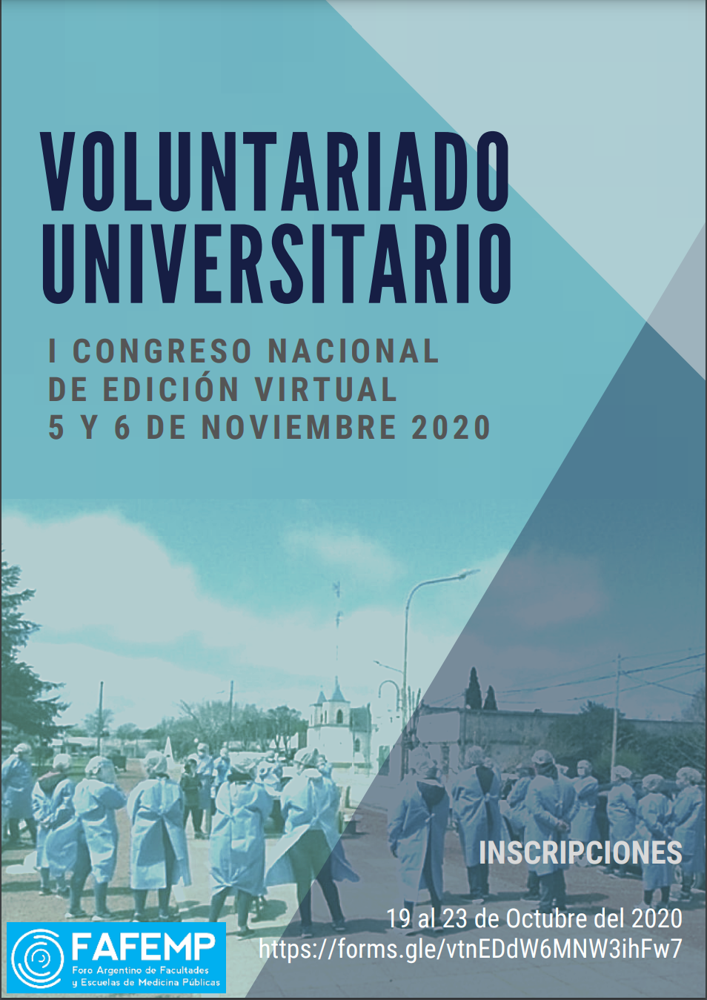

## Portfolio

---
### University Volunteer Project in Argentina 2020

Voluntary - University project

**Project description** 

UNPSJB University was participating in a nationwide university volunteer project to assist in COVID-19 swabbing and care in 2020.

My contribution to this project was the creation of the e-mail, poster and poll, as well as an informatic program that showed the graphs of the distribution of volunteers in the country.

The program was developed in R with Shiny, and [here is the link](https://rsradulescu.shinyapps.io/voluntariado/).

---
[Back](./)
